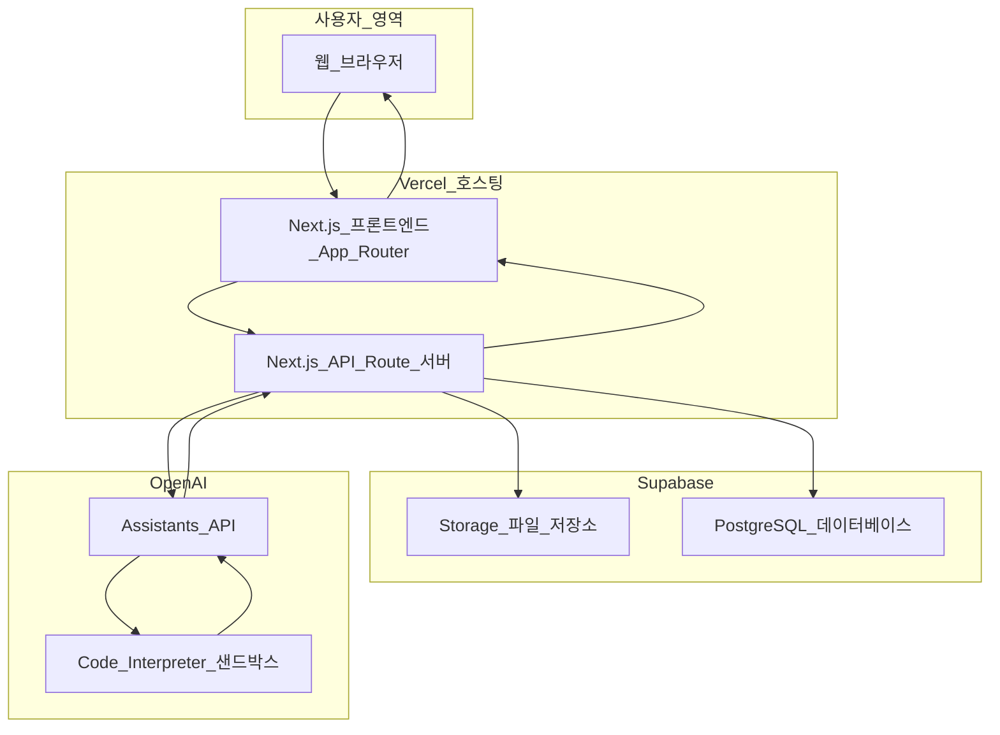
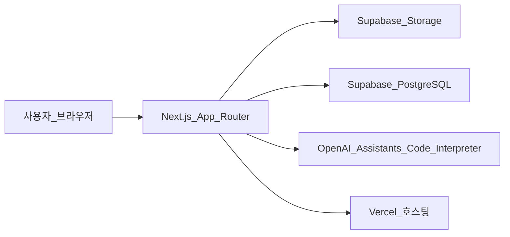
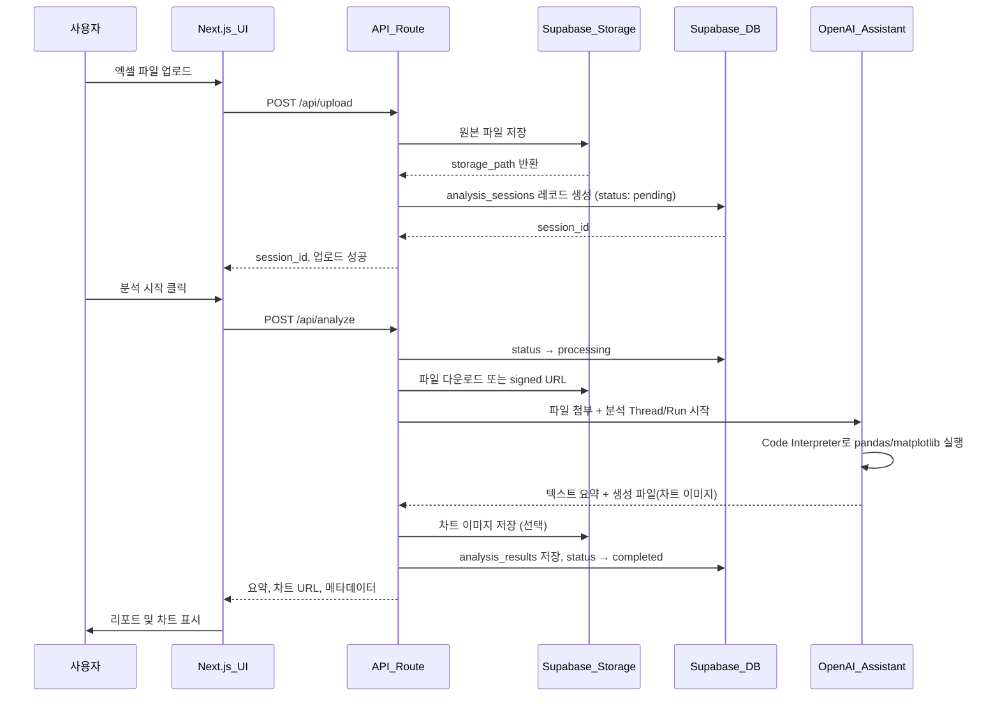
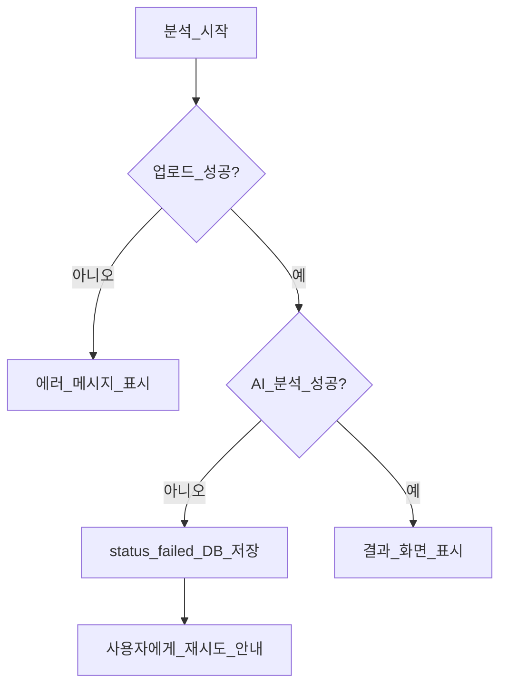
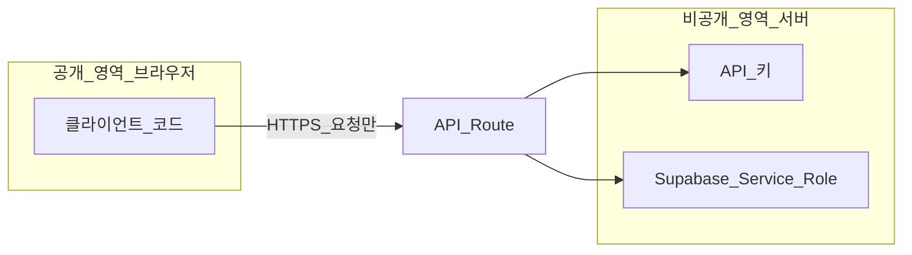

# 01. 시스템 아키텍처

> **이 문서를 읽으면 알 수 있는 것**
>
> - AI 엑셀 분석 서비스가 어떤 구성 요소로 이루어져 있는지
> - 사용자가 파일을 업로드한 뒤 결과가 화면에 표시되기까지의 전체 흐름
> - 각 기술(Next.js, Supabase, OpenAI, Vercel)이 어떤 역할을 담당하는지

---

## 목차

1. [서비스 개요](#1-서비스-개요)
2. [비개발자를 위한 비유](#2-비개발자를-위한-비유)
3. [전체 시스템 구성도](#3-전체-시스템-구성도)
4. [데이터 흐름도](#4-데이터-흐름도)
5. [주요 컴포넌트 역할](#5-주요-컴포넌트-역할)
6. [API 경계와 보안](#6-api-경계와-보안)
7. [1차 버전 범위와 가정](#7-1차-버전-범위와-가정)

---

## 1. 서비스 개요

**AI 엑셀 자동 분석 및 시각화 웹 서비스**는 사용자가 엑셀(`.xlsx`) 또는 CSV(`.csv`) 파일을 업로드하면, OpenAI의 **Assistants API + Code Interpreter**가 데이터를 분석하고, 요약·인사이트·차트를 생성하여 웹 화면에 보여주는 서비스입니다.

### 사용자 관점에서의 흐름 (한 줄 요약)

```
파일 업로드 → 저장 → AI 분석 요청 → 결과 수신 → 차트/리포트 확인
```

### 핵심 기능

| 기능 | 설명 |
|------|------|
| 파일 업로드 | 드래그앤드롭 또는 파일 선택으로 엑셀/CSV 전송 |
| AI 자동 분석 | Code Interpreter가 Python(pandas, matplotlib 등)으로 데이터 처리 |
| 결과 시각화 | AI가 생성한 차트 이미지 + 구조화된 요약을 UI에 표시 |
| 분석 이력 저장 | Supabase DB에 세션·결과 메타데이터 보관 (재조회 가능) |

---

## 2. 비개발자를 위한 비유

시스템을 **레스토랑**에 비유하면 이해하기 쉽습니다.

| 비유 | 실제 기술 | 역할 |
|------|-----------|------|
| **홀 (손님 공간)** | 사용자 브라우저 + Next.js UI | 메뉴(화면)를 보고, 주문(업로드)을 내림 |
| **주방** | Next.js API Route (서버) | 손님 요청을 받아 창고·일기장·분석가에게 전달 |
| **창고** | Supabase Storage | 업로드된 원본 엑셀 파일 보관 |
| **일기장** | Supabase PostgreSQL | 분석 세션 ID, 상태, 결과 요약 등 기록 |
| **전문 분석가** | OpenAI Assistants (Code Interpreter) | 파일을 열어 통계·차트 생성 |
| **건물 임대** | Vercel | 웹 서비스를 인터넷에 올려두는 공간 |

> **중요:** OpenAI API 키 같은 "비밀 재료"는 **주방(서버)** 안에만 두고, 손님(브라우저)에게는 절대 노출하지 않습니다.

---

## 3. 전체 시스템 구성도



### 계층별 설명



| 계층 | 기술 | 담당 |
|------|------|------|
| 프레젠테이션 | Next.js + Tailwind CSS | 화면, 업로드 UI, 차트/리포트 표시 |
| 애플리케이션 | Next.js API Route | 비즈니스 로직, 외부 API 호출 조율 |
| 데이터 | Supabase | 파일 저장 + 관계형 DB |
| AI | OpenAI Assistants | 코드 기반 데이터 분석 |
| 인프라 | Vercel | 빌드·배포·HTTPS |

---

## 4. 데이터 흐름도

### 4.1 정상 흐름 (Happy Path)



### 4.2 단계별 데이터 변화

| 단계 | 입력 | 출력 | 저장 위치 |
|------|------|------|-----------|
| 1. 업로드 | `.xlsx` / `.csv` 바이너리 | `storage_path`, `session_id` | Supabase Storage + DB |
| 2. 분석 요청 | `session_id`, 분석 옵션(선택) | OpenAI Run ID | DB (status 갱신) |
| 3. AI 처리 | 파일 + 프롬프트 | Python 실행 결과, 차트 PNG | OpenAI 샌드박스 |
| 4. 결과 저장 | AI 응답 | `summary`, `chart_urls`, `raw_response` | DB (+ Storage) |
| 5. UI 표시 | DB/Storage URL | 렌더링된 차트·텍스트 | 브라우저 |

### 4.3 오류 흐름



- 파일 형식 오류, 용량 초과 → 업로드 단계에서 차단
- OpenAI 타임아웃/할당량 → DB `status: failed`, UI에 친절한 메시지
- 네트워크 오류 → 재시도 버튼 제공

---

## 5. 주요 컴포넌트 역할

### 5.1 프론트엔드 (Next.js App Router)

| 경로 (예정) | 역할 |
|-------------|------|
| `app/page.tsx` | 랜딩 / 서비스 소개 |
| `app/upload/page.tsx` | 파일 업로드, 분석 시작 |
| `app/analysis/[id]/page.tsx` | 분석 결과·차트·요약 표시 |
| `components/features/file-uploader.tsx` | 드래그앤드롭 업로드 UI |
| `components/features/analysis-report.tsx` | AI 리포트 렌더링 |
| `components/features/chart-display.tsx` | 차트 이미지/인터랙티브 차트 |

**설계 원칙:** 페이지는 "조립"만 하고, 실제 UI 로직은 `components/`로 분리합니다.

### 5.2 API Route (서버)

| 경로 (예정) | HTTP | 역할 |
|-------------|------|------|
| `app/api/upload/route.ts` | POST | 파일 검증 → Storage 업로드 → DB 세션 생성 |
| `app/api/analyze/route.ts` | POST | OpenAI Assistant 호출, Run 폴링/스트리밍 |
| `app/api/analysis/[id]/route.ts` | GET | 세션 상태·결과 조회 |

> API Route는 **항상 서버에서만** 실행됩니다. OpenAI·Supabase Service Role 키는 여기서만 사용합니다.

### 5.3 Supabase Storage

- **버킷명 (예정):** `excel-uploads`
- **저장 대상:** 사용자 업로드 원본, AI 생성 차트 이미지(선택)
- **경로 규칙 (예):** `{session_id}/{original_filename}`

### 5.4 Supabase PostgreSQL

**예상 테이블 (1차 버전):**

```sql
-- analysis_sessions: 한 번의 업로드·분석 단위
-- id, file_name, storage_path, status, created_at, updated_at

-- analysis_results: AI 분석 결과
-- id, session_id, summary, chart_urls, metadata, created_at
```

상세 스키마는 [03_development_plan.md](./03_development_plan.md) Phase 3에서 정의합니다.

### 5.5 OpenAI Assistants + Code Interpreter

| 개념 | 설명 |
|------|------|
| **Assistant** | "엑셀 데이터 분석 전문가" 역할을 부여한 AI 에이전트 |
| **Thread** | 한 번의 대화/분석 세션 |
| **Run** | Thread에서 Assistant가 실제로 작업을 수행하는 실행 단위 |
| **Code Interpreter** | Python 코드를 샌드박스에서 실행하는 도구 (pandas, matplotlib 사용) |

**동작 요약:**

1. 업로드된 파일을 OpenAI Files API로 전송
2. Assistant에 파일을 첨부하고 "이 데이터를 분석하고 차트를 만들어줘"라고 요청
3. Code Interpreter가 Python으로 통계·시각화 수행
4. 텍스트 답변 + 생성된 이미지 파일을 API Route가 수신

---

## 6. API 경계와 보안

### 6.1 신뢰 경계 (Trust Boundary)



| 항목 | 클라이언트 노출 | 비고 |
|------|-----------------|------|
| `NEXT_PUBLIC_SUPABASE_URL` | 가능 | 공개 URL |
| `NEXT_PUBLIC_SUPABASE_ANON_KEY` | 가능 | RLS로 보호 필요 |
| `SUPABASE_SERVICE_ROLE_KEY` | **금지** | 서버 전용 |
| `OPENAI_API_KEY` | **금지** | 서버 전용 |

### 6.2 보안 체크리스트

- [ ] `.env.local`은 Git에 커밋하지 않음 (`.gitignore` 등록)
- [ ] Storage 버킷: 업로드 크기·MIME 타입 제한
- [ ] DB: Row Level Security(RLS) 정책 적용 (Auth 도입 시)
- [ ] API Route: 요청 본문 `zod` 검증
- [ ] 프로덕션: Vercel 환경 변수에만 시크릿 저장

---

## 7. 1차 버전 범위와 가정

본 아키텍처는 **MVP(최소 기능 제품)** 기준입니다.

| 항목 | 1차 버전 | 이후 확장 |
|------|----------|-----------|
| 사용자 인증 | 세션 ID 기반 (간단) | Supabase Auth (이메일/소셜) |
| 지원 파일 | `.xlsx`, `.csv` | `.xls`, Google Sheets 연동 |
| 분석 결과 | 텍스트 + 차트 이미지 | JSON 구조화 + 인터랙티브 차트 |
| 동시 사용자 | 소규모 | 큐(Queue) 기반 비동기 처리 |

---

## 다음 문서

- 기술 선택 이유와 라이브러리: [02_tech_stack.md](./02_tech_stack.md)
- 구현 순서: [03_development_plan.md](./03_development_plan.md)
- 코드 작성 규칙: [04_coding_guideline.md](./04_coding_guideline.md)
