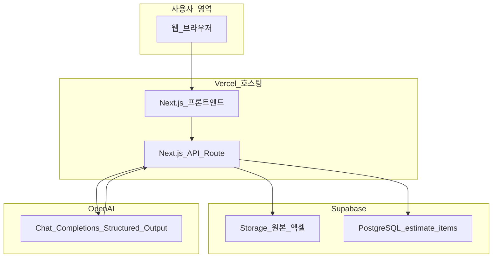
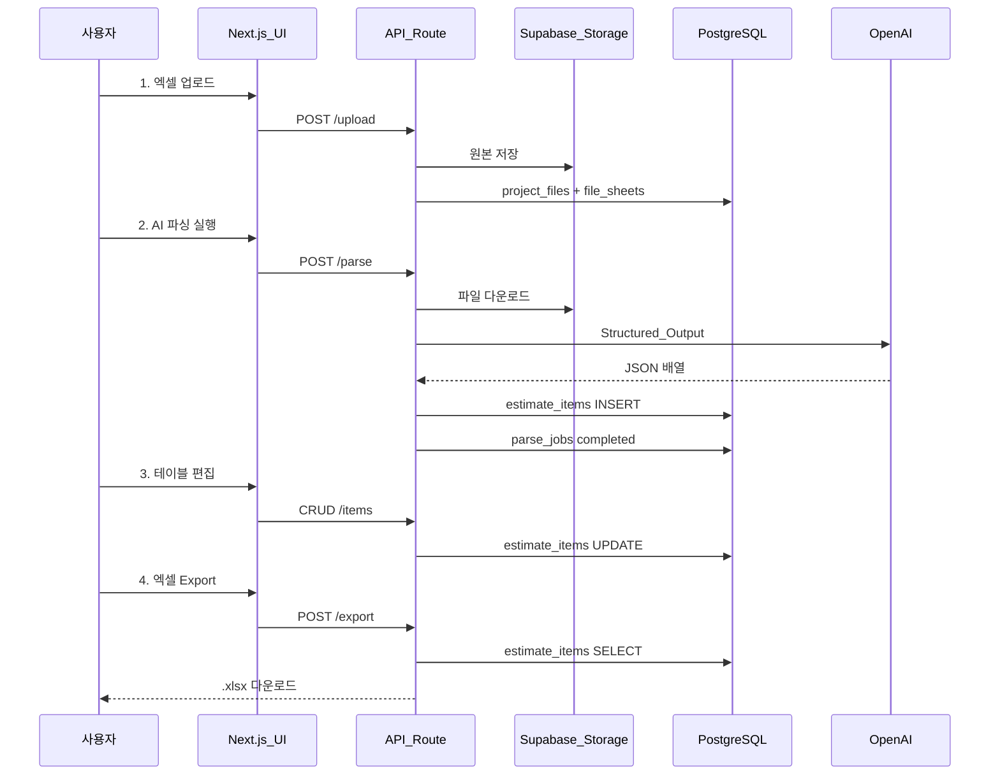

# 01. 시스템 아키텍처 (v2 — 구조화 데이터 자산화)

> **이 문서를 읽으면 알 수 있는 것**
>
> - AI 엑셀 분석 서비스가 **어떤 구성 요소**로 이루어져 있는지
> - 엑셀 업로드 → AI 파싱 → DB 저장 → 편집 → Export까지의 **전체 흐름**
> - 각 기술(Next.js, Supabase, OpenAI, Vercel)이 **어떤 역할**을 담당하는지

---

## 목차

1. [서비스 개요](#1-서비스-개요)
2. [비개발자를 위한 비유](#2-비개발자를-위한-비유)
3. [전체 시스템 구성도](#3-전체-시스템-구성도)
4. [핵심 데이터 흐름 4단계](#4-핵심-데이터-흐름-4단계)
5. [주요 컴포넌트 역할](#5-주요-컴포넌트-역할)
6. [API 경계와 보안](#6-api-경계와-보안)
7. [1차 버전 범위](#7-1차-버전-범위)
8. [구 아키텍처 폐기 사유](#8-구-아키텍처-폐기-사유)

---

## 1. 서비스 개요

**AI 엑셀 자동 분석 시스템**은 사용자가 공사내역·견적 엑셀(`.xlsx`)을 업로드하면, OpenAI가 **정형 데이터(JSON)** 로 항목을 추출하고, Supabase DB에 **행 단위로 저장**한 뒤, 웹에서 **표로 편집**하고 **회사 양식 엑셀로 다운로드**할 수 있는 웹 서비스입니다.

### 사용자 관점에서의 흐름 (한 줄 요약)

```
엑셀 업로드 → AI 파싱 → DB 저장 → 웹 표 편집 → 회사 양식 엑셀 Export
```

### 핵심 기능

| 기능 | 설명 |
|------|------|
| 파일 업로드 | 드래그앤드롭으로 `.xlsx` / `.csv` 전송, Supabase Storage 보관 |
| AI 구조화 파싱 | OpenAI Structured Output으로 품명·규격·수량·단가 등 추출 |
| DB 자산화 | `estimate_items` 테이블에 **1행 = 1레코드** 저장 |
| 데이터 테이블 UI | 조회·정렬·필터·인라인 편집·행 추가/삭제 |
| 엑셀 Export | DB 데이터 → 회사 지정 양식 `.xlsx` 생성·다운로드 |

---

## 2. 비개발자를 위한 비유

시스템을 **사무실**에 비유하면 이해하기 쉽습니다.

| 비유 | 실제 기술 | 역할 |
|------|-----------|------|
| **접수 창구** | Next.js UI (브라우저) | 파일 접수, 표 편집, Export 버튼 |
| **사무 처리팀** | Next.js API Route (서버) | 요청 검증, AI 호출, DB 읽기/쓰기 |
| **창고** | Supabase Storage | 업로드된 **원본 엑셀** 보관 |
| **장부(대장)** | Supabase PostgreSQL | 추출된 **항목 데이터** (`estimate_items`) |
| **AI 분류기** | OpenAI Chat Completions + JSON Schema | 엑셀 내용 → 정형 JSON 변환 |
| **인쇄소** | Export API + `xlsx` 라이브러리 | 장부 데이터 → 깔끔한 엑셀 파일 생성 |
| **건물** | Vercel | 웹 서비스를 인터넷에 올려두는 공간 |

> **중요:** OpenAI API 키는 **사무 처리팀(서버)** 안에만 두고, 사용자 브라우저에는 절대 노출하지 않습니다.

---

## 3. 전체 시스템 구성도



| 레이어 | 기술 | 역할 |
|--------|------|------|
| 프론트엔드 | Next.js App Router | 업로드 UI, 데이터 테이블, Export 버튼 |
| 백엔드 | Next.js API Route | 파싱·CRUD·Export 로직 |
| DB | Supabase PostgreSQL | 프로젝트·파일·항목·파싱 이력 |
| Storage | Supabase Storage | 원본 엑셀 바이너리 |
| AI | OpenAI Structured Output | 엑셀 → JSON 배열 추출 |
| 호스팅 | Vercel | 배포·HTTPS |

---

## 4. 핵심 데이터 흐름 4단계

### 4.1 전체 시퀀스



### 4.2 단계별 설명

| 단계 | 사용자 행동 | 서버 처리 | DB 변화 |
|------|-------------|-----------|---------|
| 1. 업로드 | 파일 드래그앤드롭 | Storage 저장, 시트 메타 파싱 | `project_files`, `file_sheets` |
| 2. AI 파싱 | "AI 파싱" 버튼 클릭 | xlsx→텍스트, OpenAI JSON 추출 | `parse_jobs`, `estimate_items` |
| 3. 편집 | 표에서 셀 수정·행 추가/삭제 | CRUD API | `estimate_items` UPDATE |
| 4. Export | "엑셀 다운로드" 클릭 | DB 조회 → xlsx 생성 | (변화 없음) |

---

## 5. 주요 컴포넌트 역할

### 5.1 프론트엔드 (App Router)

| 경로 | 역할 |
|------|------|
| `/login` | Supabase Auth 로그인·회원가입 |
| `/` | 대시보드 (프로젝트 요약) |
| `/projects` | 프로젝트 목록·생성 |
| `/projects/[id]` | **작업 공간**: 업로드 + 파싱 + 데이터 테이블 + Export |

| 컴포넌트 | 역할 |
|----------|------|
| `file-upload-panel.tsx` | 파일 업로드 (기존) |
| `estimate-items-table.tsx` | **신규** — DB 항목 표시·편집 |
| `parse-action-bar.tsx` | **신규** — 파싱 실행·상태 표시 |
| `export-button.tsx` | **신규** — 엑셀 다운로드 |

> **폐기:** `ai-chat-panel.tsx` (AI 채팅 UI) — 구 아키텍처

### 5.2 API Route (서버)

| API | 메서드 | 역할 |
|-----|--------|------|
| `/api/projects` | POST | 프로젝트 생성 |
| `/api/projects/[id]/upload` | POST | Storage 업로드 + 메타 저장 |
| `/api/projects/[id]/parse` | POST | **신규** — AI Structured Output 파싱 |
| `/api/projects/[id]/items` | GET/POST/PATCH/DELETE | **신규** — `estimate_items` CRUD |
| `/api/projects/[id]/export` | POST | **신규** — 회사 양식 xlsx 생성 |

> **폐기:** `/api/projects/[id]/chat` (Assistants API 채팅)

### 5.3 OpenAI 연동 방식

| 항목 | 구 방식 (폐기) | 신 방식 |
|------|----------------|---------|
| API | Assistants + Code Interpreter | **Chat Completions + JSON Schema** |
| 입력 | OpenAI Files API 첨부 | 엑셀 → 텍스트/행 JSON (서버 전처리) |
| 출력 | Thread 메시지 (자유 텍스트) | **고정 JSON 스키마** (품명, 수량…) |
| 속도 | 30초~2분 | **수 초~30초** (목표) |
| 저장 | `analysis_results` 텍스트 | **`estimate_items` 행** |

### 5.4 Supabase

| 서비스 | 용도 |
|--------|------|
| Auth | 이메일 로그인, `auth.uid()` |
| PostgreSQL | `projects`, `estimate_items` 등 |
| Storage | `project-files` 버킷 (원본 엑셀) |
| RLS | 본인 프로젝트만 접근 |

---

## 6. API 경계와 보안

### 6.1 서버 전용 (클라이언트 노출 금지)

| 환경 변수 | 용도 |
|-----------|------|
| `OPENAI_API_KEY` | OpenAI API 인증 |
| `SUPABASE_SERVICE_ROLE_KEY` | Storage 다운로드, 서버 DB 쓰기 |

### 6.2 클라이언트 허용

| 환경 변수 | 용도 |
|-----------|------|
| `NEXT_PUBLIC_SUPABASE_URL` | Supabase 연결 |
| `NEXT_PUBLIC_SUPABASE_ANON_KEY` | Auth + RLS 보호된 조회 |

### 6.3 데이터 접근 규칙

- 모든 API Route: Supabase 세션으로 **로그인 확인**
- 프로젝트·항목: **소유자(`user_id = auth.uid()`)만** CRUD
- RLS: [06_database_schema.md](./06_database_schema.md) 11절 참고

---

## 7. 1차 버전 범위

### 포함 (P0)

- Supabase Auth 로그인
- 프로젝트 CRUD
- `.xlsx` / `.csv` 업로드
- AI Structured Output 파싱 → `estimate_items`
- 데이터 테이블 UI (조회·편집·행 CRUD)
- 회사 양식 엑셀 Export

### 제외 (구 아키텍처·후속)

- AI 채팅 UI
- Code Interpreter / Assistants API
- AI 차트·요약 리포트 (`analysis_results`)
- 다중 Export 템플릿 선택 (P1)
- 파일 간 자동 교차 매칭 AI (P1)

---

## 8. 구 아키텍처 폐기 사유

| 문제 | 설명 |
|------|------|
| **속도** | Assistants + Code Interpreter Run 폴링 → 30초~2분 대기 |
| **실무 활용도** | 텍스트 답변만 제공 → 표 편집·Export 불가 |
| **데이터 자산화 불가** | DB에 구조화된 행이 없어 재가공·검증 어려움 |
| **비용** | Code Interpreter 실행 시간 과금 |

**신 아키텍처**는 AI 결과를 **즉시 DB 행으로 저장**하여, 사람이 검증·수정한 뒤 **회사 양식 엑셀**로 내보낼 수 있습니다.

---

## 관련 문서

- [05_system_requirements.md](./05_system_requirements.md) — 기능 명세·시나리오
- [06_database_schema.md](./06_database_schema.md) — DB 테이블 설계
- [03_development_plan.md](./03_development_plan.md) — Phase 4~8 로드맵
- [08_new_schema_migration.sql](./08_new_schema_migration.sql) — DB 마이그레이션 SQL

> **참고:** [02_tech_stack.md](./02_tech_stack.md), [04_coding_guideline.md](./04_coding_guideline.md), [07_environment_setup_guide.md](./07_environment_setup_guide.md)는 아직 구 아키텍처(Assistants)를 일부 참조합니다. 코드·문서 후속 업데이트 예정입니다.
