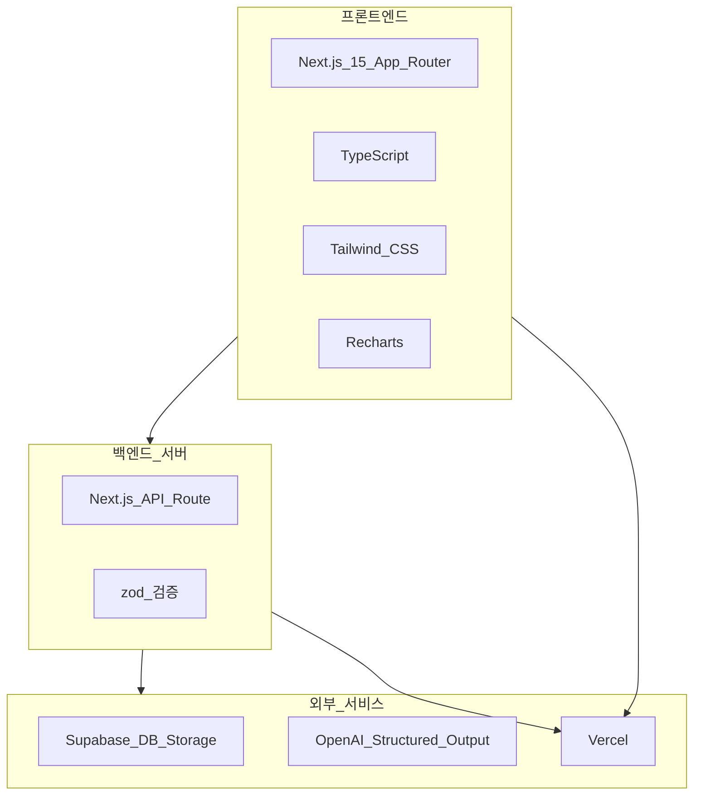
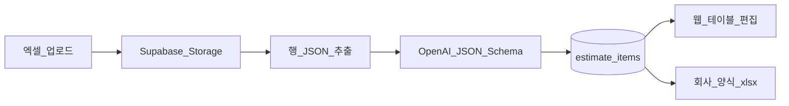

# 02. 기술 스택

> **이 문서를 읽으면 알 수 있는 것**
>
> - 이 프로젝트에서 사용하는 기술과 라이브러리 전체 목록
> - 각 기술을 **왜** 선택했는지 (대안과 비교)
> - 개발·배포 시 필요한 환경 변수 설정 방법

---

## 목차

1. [기술 스택 한눈에 보기](#1-기술-스택-한눈에-보기)
2. [핵심 기술 상세](#2-핵심-기술-상세)
3. [npm 패키지 목록](#3-npm-패키지-목록)
4. [OpenAI Structured Output 파싱](#4-openai-structured-output-파싱-v2)
5. [환경 변수 설정](#5-환경-변수-설정)
6. [개발 도구](#6-개발-도구)
7. [향후 검토 가능한 기술](#7-향후-검토-가능한-기술)

---

## 1. 기술 스택 한눈에 보기



| 영역 | 기술 | 버전 (권장) | 선택 이유 |
|------|------|-------------|-----------|
| 프레임워크 | **Next.js** (App Router) | 15.x | React 기반 풀스택, API Route 내장, Vercel과 최적 호환 |
| 언어 | **TypeScript** | 5.x | 타입으로 버그 예방, AI·협업 시 코드 의도 명확 |
| 스타일 | **Tailwind CSS** | 4.x / 3.x | 유틸리티 클래스로 빠른 UI, 디자인 일관성 |
| DB + Storage | **Supabase** | 최신 | PostgreSQL + 파일 저장 + Auth를 한 곳에서 제공 |
| AI | **OpenAI Chat Completions** | 최신 | Structured Output(JSON Schema)로 견적 항목 추출 |
| 배포 | **Vercel** | - | Next.js 공식 플랫폼, Git push만으로 배포 |

---

## 2. 핵심 기술 상세

### 2.1 Next.js (App Router)

**Next.js**는 React 위에 페이지 라우팅, 서버 렌더링, API를 올려준 **웹 애플리케이션 프레임워크**입니다.

| App Router 특징 | 이 프로젝트에서의 활용 |
|-----------------|------------------------|
| `app/` 폴더 기반 라우팅 | `/upload`, `/analysis/[id]` 페이지 구성 |
| Server Components | DB 조회 등 서버에서 데이터 fetch |
| API Route (`route.ts`) | OpenAI·Supabase 호출, API 키 보호 |
| `loading.tsx`, `error.tsx` | 분석 대기·오류 UI |

**Pages Router 대신 App Router를 쓰는 이유:** Next.js 공식 권장 방향이며, Server Component와 스트리밍 UI에 유리합니다.

---

### 2.2 TypeScript

JavaScript에 **타입(종류) 정보**를 추가한 언어입니다.

```typescript
// 예: 분석 세션의 상태는 정해진 값만 허용
type AnalysisStatus = 'pending' | 'processing' | 'completed' | 'failed';

interface AnalysisSession {
  id: string;
  fileName: string;
  status: AnalysisStatus;
  createdAt: string;
}
```

- `pending` 오타를 `pendng`으로 쓰면 **컴파일 단계에서** 오류 발견
- API 응답 형태를 팀(또는 AI)과 공유하기 쉬움

---

### 2.3 Tailwind CSS

HTML 클래스 이름으로 스타일을 적용하는 **유틸리티 CSS 프레임워크**입니다.

```tsx
// 예: 업로드 영역 스타일
<div className="border-2 border-dashed border-gray-300 rounded-lg p-8 hover:border-blue-500">
  파일을 여기에 놓으세요
</div>
```

**선택 이유:** 별도 CSS 파일 없이 빠르게 UI를 만들 수 있고, 디자인 토큰(색, 간격)이 일관됩니다.

---

### 2.4 Supabase

**오픈소스 Firebase 대안**으로, PostgreSQL 데이터베이스와 파일 저장(Storage), 인증(Auth)을 제공합니다.

| Supabase 기능 | 이 프로젝트 용도 |
|---------------|------------------|
| **PostgreSQL** | 프로젝트, 파일, `estimate_items`, `parse_jobs` |
| **Storage** | 업로드된 엑셀 원본 (`project-files` 버킷) |
| **Auth** | 사용자 로그인, RLS와 연동 |
| **Dashboard** | SQL 편집, Storage 버킷 관리 |

**Firebase/AWS 대신 Supabase를 쓰는 이유:**

- SQL(PostgreSQL)로 복잡한 조회·관계 표현이 쉬움
- 무료 티어로 MVP 개발에 충분
- Next.js 공식 가이드와 `@supabase/ssr` 패키지 지원

---

### 2.5 OpenAI Structured Output (파싱)

엑셀 시트 데이터를 **JSON Schema**에 맞는 구조화된 항목으로 추출합니다.

| 구성 요소 | 설명 |
|-----------|------|
| Chat Completions | `gpt-4o-mini` (기본) 또는 `OPENAI_PARSE_MODEL` |
| JSON Schema | `item_name`, `quantity`, `unit_price` 등 필드 정의 |
| `lib/openai/parse.ts` | 시트 JSON → `estimate_items` INSERT |

**Assistants + Code Interpreter를 쓰지 않는 이유:** Run 폴링 대기(30초~2분) 없이 **수 초 내** 항목 추출이 가능하고, 결과를 DB 행으로 바로 저장·편집·Export할 수 있습니다.

---

### 2.6 Vercel

Next.js를 만든 회사의 **호스팅·배포 플랫폼**입니다.

- GitHub 연결 → push 시 자동 빌드·배포
- 환경 변수 UI로 시크릿 관리
- Edge/Serverless 함수로 API Route 실행

---

## 3. npm 패키지 목록

### 3.1 프로덕션 의존성 (dependencies)

| 패키지 | 용도 | 비고 |
|--------|------|------|
| `next` | 프레임워크 | App Router |
| `react`, `react-dom` | UI 라이브러리 | Next.js peer dependency |
| `@supabase/supabase-js` | Supabase 클라이언트 | DB, Storage 접근 |
| `@supabase/ssr` | Supabase SSR 헬퍼 | Next.js App Router 쿠키 연동 |
| `openai` | OpenAI 공식 SDK | Chat Completions + JSON Schema 파싱 |
| `xlsx` | SheetJS | 업로드 전처리, Export `.xlsx` 생성 |
| `react-dropzone` | 파일 드래그앤드롭 | 업로드 UX |
| `zod` | 스키마 검증 | API 요청/응답 타입 안전 |
| `lucide-react` | 아이콘 | 업로드, 로딩, 성공/실패 아이콘 |
| `clsx`, `tailwind-merge` | 클래스명 병합 | 조건부 Tailwind 클래스 (`cn` 유틸) |

### 3.2 개발 의존성 (devDependencies)

| 패키지 | 용도 |
|--------|------|
| `typescript` | TypeScript 컴파일 |
| `@types/node`, `@types/react`, `@types/react-dom` | 타입 정의 |
| `tailwindcss`, `postcss`, `autoprefixer` | Tailwind 빌드 |
| `eslint`, `eslint-config-next` | 코드 린트 |

### 3.3 설치 명령 (초기 세팅 시 참고)

```bash
# Next.js 프로젝트 생성 시 Tailwind, ESLint, App Router 옵션 선택 후
npm install @supabase/supabase-js @supabase/ssr openai xlsx react-dropzone zod lucide-react clsx tailwind-merge
```

> **참고:** `chart.js`는 Recharts 대안입니다. 1차 버전은 AI가 생성한 **이미지 차트**를 우선 표시하고, Recharts는 구조화된 JSON이 있을 때 보조로 사용합니다.

---

## 4. OpenAI Structured Output 파싱 (v2)

### 4.1 동작 원리

1. **업로드:** `.xlsx` / `.csv` → Supabase Storage
2. **전처리:** `lib/excel/extract-sheet-data.ts` — 시트별 행 JSON (최대 100행/시트)
3. **AI 추출:** OpenAI Chat Completions + JSON Schema → 품명·수량·단가 등
4. **저장:** `estimate_items` 테이블 INSERT
5. **Export:** DB 조회 → `lib/excel/build-export-workbook.ts` → `.xlsx` 다운로드



### 4.2 비용·제한 (운영 시 참고)

| 항목 | 내용 |
|------|------|
| 과금 | Chat Completions 토큰 사용량 |
| 파싱 범위 | 시트당 최대 100행 (대용량은 후속 확장) |
| 타임아웃 | Vercel Serverless `maxDuration` 120초 (parse API) |

---

## 5. 환경 변수 설정

### 5.1 변수 목록

| 변수명 | 공개 여부 | 설명 |
|--------|-----------|------|
| `NEXT_PUBLIC_SUPABASE_URL` | 공개 가능 | Supabase 프로젝트 URL |
| `NEXT_PUBLIC_SUPABASE_ANON_KEY` | 공개 가능 | 클라이언트용 anon key (RLS 적용) |
| `SUPABASE_SERVICE_ROLE_KEY` | **비공개** | 서버 전용, RLS 우회 가능 |
| `OPENAI_API_KEY` | **비공개** | OpenAI API 인증 (파싱) |
| `OPENAI_PARSE_MODEL` | **비공개** | 파싱 모델 (선택, 기본 `gpt-4o-mini`) |
| `NEXT_PUBLIC_SITE_URL` | 공개 가능 | Auth 콜백·리다이렉트 URL |

> `NEXT_PUBLIC_` 접두사가 붙은 변수만 브라우저 번들에 포함됩니다.

### 5.2 `.env.local` 예시

프로젝트 루트에 `.env.local` 파일을 만들고, **실제 키는 본인 계정에서 발급**받아 넣습니다.

```env
# Supabase (Dashboard → Settings → API)
NEXT_PUBLIC_SUPABASE_URL=https://your-project.supabase.co
NEXT_PUBLIC_SUPABASE_ANON_KEY=eyJhbGciOiJIUzI1NiIsInR5cCI6IkpXVCJ9...
SUPABASE_SERVICE_ROLE_KEY=eyJhbGciOiJIUzI1NiIsInR5cCI6IkpXVCJ9...

# OpenAI (platform.openai.com → API keys)
OPENAI_API_KEY=sk-proj-xxxxxxxxxxxxxxxx
# OPENAI_PARSE_MODEL=gpt-4o

# 사이트 URL (로컬 / Vercel)
NEXT_PUBLIC_SITE_URL=http://localhost:3000
```

### 5.3 `.env.example` (Git에 커밋)

팀원·미래의 자신을 위해 **키 없이 이름만** 적은 템플릿을 커밋합니다.

```env
NEXT_PUBLIC_SUPABASE_URL=
NEXT_PUBLIC_SUPABASE_ANON_KEY=
SUPABASE_SERVICE_ROLE_KEY=
OPENAI_API_KEY=
OPENAI_ASSISTANT_ID=
```

### 5.4 Vercel 배포 시

Vercel Dashboard → Project → Settings → Environment Variables 에 동일한 이름으로 등록합니다.

---

## 6. 개발 도구

| 도구 | 용도 |
|------|------|
| **Node.js** | 20 LTS 권장 |
| **npm** 또는 **pnpm** | 패키지 관리 |
| **VS Code / Cursor** | 코드 편집, AI 보조 |
| **Supabase Dashboard** | DB·Storage 관리 |
| **OpenAI Platform** | API 키, Usage 모니터링 |
| **Git + GitHub** | 버전 관리, Vercel 연동 |

---

## 7. 향후 검토 가능한 기술

1차 MVP 이후 필요에 따라 도입을 검토합니다.

| 기술 | 도입 시점 | 용도 |
|------|-----------|------|
| Supabase Auth | 사용자 로그인 필요 시 | 이메일/소셜 로그인 |
| Inngest / BullMQ | 대용량·장시간 분석 | 백그라운드 Job 큐 |
| Sentry | 프로덕션 안정화 | 에러 모니터링 |
| Upstash Redis | Rate limiting | API 남용 방지 |

---

## 다음 문서

- 시스템 구조: [01_system_architecture.md](./01_system_architecture.md)
- 구현 순서: [03_development_plan.md](./03_development_plan.md)
- 코드 규칙: [04_coding_guideline.md](./04_coding_guideline.md)
