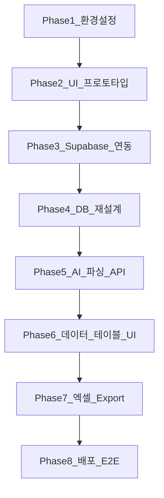
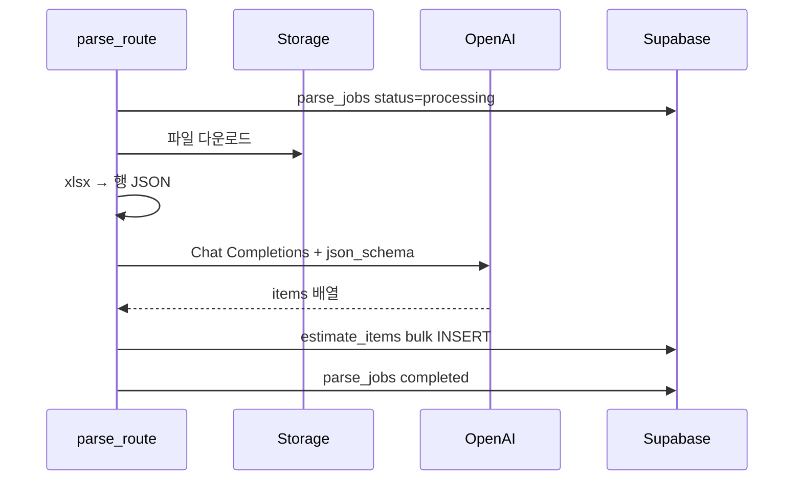

# 03. 개발 계획 (로드맵 v2 — 구조화 데이터 자산화)

> **이 문서를 읽으면 알 수 있는 것**
>
> - 프로젝트를 **어떤 순서로**, **몇 단계로** 만들지
> - 각 Phase가 끝났는지 확인하는 **완료 기준 (체크리스트)**
> - **구 아키텍처(Phase 4 Assistants)** 와 **신 아키텍처(Phase 4~8)** 의 관계

---

## 목차

1. [로드맵 개요](#1-로드맵-개요)
2. [Phase 1~3: 완료된 기반](#phase-13-완료된-기반)
3. [Phase 4: DB 재설계](#phase-4-db-재설계)
4. [Phase 5: AI 파싱 API](#phase-5-ai-파싱-api)
5. [Phase 6: 데이터 테이블 UI](#phase-6-데이터-테이블-ui)
6. [Phase 7: 엑셀 Export](#phase-7-엑셀-export)
7. [Phase 8: 배포 및 E2E](#phase-8-배포-및-e2e)
8. [구 로드맵 (폐기)](#8-구-로드맵-폐기)
9. [리스크 및 대응](#9-리스크-및-대응)

---

## 1. 로드맵 개요



| Phase | 상태 | 이름 | 핵심 산출물 |
|-------|------|------|-------------|
| 1 | ✅ 완료 | 환경 설정 | Next.js, `.env.example`, 외부 계정 |
| 2 | ✅ 완료 | UI 프로토타입 | 대시보드, 업로드 UI (목 데이터) |
| 3 | ✅ 완료 | Supabase 연동 | Auth, Storage 업로드, 프로젝트 CRUD |
| **4** | ✅ 완료 | **DB 재설계** | `parse_jobs`, `estimate_items`, 마이그레이션 SQL |
| **5** | ✅ 완료 | **AI 파싱 API** | Structured Output → DB INSERT |
| **6** | ✅ 완료 | **데이터 테이블 UI** | 조회·편집·CRUD |
| **7** | ✅ 완료 | **엑셀 Export** | 회사 양식 `.xlsx` 생성 |
| **8** | ✅ 완료 | **배포·E2E** | Vercel, 전체 흐름 검증 가이드 |

> **아키텍처 전환 완료:** 구 Assistants 채팅·Code Interpreter 코드는 제거되었습니다.  
> E2E 체크리스트: [09_e2e_checklist.md](./09_e2e_checklist.md)

---

## Phase 1~3: 완료된 기반

### Phase 1 — 환경 설정 ✅

- Next.js App Router, TypeScript, Tailwind
- `.env.example`, Supabase·OpenAI 계정
- `npm run dev` 로컬 실행

### Phase 2 — UI 프로토타입 ✅

- 대시보드, Sidebar, 프로젝트 목록
- 업로드·채팅 UI (당시 Mock)

### Phase 3 — Supabase 연동 ✅

- Supabase Auth (이메일 로그인)
- `projects`, `project_files`, `file_sheets` CRUD
- Storage `project-files` 업로드 API
- RLS, middleware 보호

**Phase 3에서 유지·재사용하는 코드:**

- [`app/api/projects/[id]/upload/route.ts`](../app/api/projects/[id]/upload/route.ts)
- [`lib/data/projects.ts`](../lib/data/projects.ts)
- Auth, Sidebar, FileUploadPanel

**Phase 4~5에서 제거·교체할 코드 (구 Phase 4):**

- [`app/api/projects/[id]/chat/route.ts`](../app/api/projects/[id]/chat/route.ts)
- [`lib/openai/assistant.ts`](../lib/openai/assistant.ts), `thread.ts`, `ensure-files.ts`
- [`components/features/ai-chat-panel.tsx`](../components/features/ai-chat-panel.tsx)

---

## Phase 4: DB 재설계

### 목표

신 아키텍처에 맞는 DB 스키마 적용. `estimate_items` 핵심 테이블 생성.

### 작업 목록

| # | 작업 | 설명 |
|---|------|------|
| 4.1 | 문서 확정 | [06_database_schema.md](./06_database_schema.md) v2 |
| 4.2 | SQL 실행 | [08_new_schema_migration.sql](./08_new_schema_migration.sql) Supabase 적용 |
| 4.3 | TypeScript 타입 | `EstimateItem`, `ParseJob`, `ProjectStatus` 갱신 |
| 4.4 | map-row 갱신 | `openai_*` 제거, `parse_status`, `estimate_items` 매핑 |
| 4.5 | 구 코드 정리 | chat API·Assistants lib 제거 (또는 deprecated 표시) |

### 예상 파일

```
types/
  project.ts          # status, parse_status 갱신
  estimate-item.ts    # 신규
  parse-job.ts        # 신규
lib/supabase/
  map-row.ts          # 갱신
docs/
  08_new_schema_migration.sql  # 실행 완료 확인
```

### 완료 기준 (체크리스트)

- [ ] Supabase SQL Editor에서 `08_new_schema_migration.sql` 실행 성공
- [ ] `parse_jobs`, `estimate_items` 테이블 존재
- [ ] `analysis_runs`, `analysis_results` 삭제 확인
- [ ] `npm run build` 성공 (타입 오류 없음)
- [ ] 기존 프로젝트·파일 데이터 유지 확인

---

## Phase 5: AI 파싱 API

### 목표

업로드된 엑셀 → OpenAI Structured Output → `estimate_items` 저장.

### 작업 목록

| # | 작업 | 설명 |
|---|------|------|
| 5.1 | xlsx 전처리 | 시트별 행 JSON 추출 (기존 `xlsx` 패키지 재사용) |
| 5.2 | OpenAI 클라이언트 | `lib/openai/parse.ts` — Structured Output 호출 |
| 5.3 | JSON Schema | [05_system_requirements.md](./05_system_requirements.md) 10.2절 스키마 |
| 5.4 | 파싱 API | `POST /api/projects/[id]/parse` |
| 5.5 | DB 저장 | `parse_jobs` + `estimate_items` INSERT |
| 5.6 | UI 트리거 | "AI 파싱" 버튼 + 로딩 상태 |
| 5.7 | 에러 처리 | 한국어 메시지, `failed` 상태 |

### API 흐름



### 예상 파일

```
app/api/projects/[id]/parse/route.ts
lib/openai/parse.ts
lib/openai/schema.ts          # JSON Schema 정의
lib/data/estimate-items.ts    # DB CRUD 헬퍼
components/features/parse-action-bar.tsx
```

### OpenAI 호출 예시 (개념)

```typescript
// lib/openai/parse.ts — 서버 전용
const response = await openai.chat.completions.create({
  model: "gpt-4o",
  messages: [
    { role: "system", content: PARSE_SYSTEM_PROMPT },
    { role: "user", content: sheetTextJson },
  ],
  response_format: {
    type: "json_schema",
    json_schema: { name: "estimate_items", schema: ESTIMATE_ITEMS_SCHEMA },
  },
});
```

### 완료 기준 (체크리스트)

- [ ] 샘플 `.xlsx` (100행 내외) 파싱 성공
- [ ] `estimate_items`에 품명·수량·단가 등 저장 확인
- [ ] `parse_jobs.rows_extracted` 값 정확
- [ ] 파싱 실패 시 한국어 에러 + `status = failed`
- [ ] `OPENAI_API_KEY` 없을 때 안내 메시지

---

## Phase 6: 데이터 테이블 UI

### 목표

`estimate_items`를 웹 표로 표시하고 편집(CRUD).

### 작업 목록

| # | 작업 | 설명 |
|---|------|------|
| 6.1 | Items API | `GET/POST/PATCH/DELETE /api/projects/[id]/items` |
| 6.2 | 테이블 컴포넌트 | `estimate-items-table.tsx` |
| 6.3 | 인라인 편집 | 셀 클릭 → 수정 → 저장 |
| 6.4 | 행 추가/삭제 | 빈 행 추가, 선택 삭제 |
| 6.5 | 정렬·필터 | 품명·제조사·공종 |
| 6.6 | 수정 표시 | `is_manually_edited` 뱃지 |
| 6.7 | 페이지 레이아웃 | 채팅 패널 → 테이블로 교체 |

### 예상 화면 (`/projects/[id]`)

```
┌──────────────────┬─────────────────────────────┐
│ 파일 업로드       │ [AI 파싱]  [엑셀 Export]     │
│                  │ ┌─────┬─────┬─────┬─────┐   │
│                  │ │공종 │품명 │수량 │단가 │...│
│                  │ ├─────┼─────┼─────┼─────┤   │
│                  │ │전기 │LED  │  2  │1.5M │   │
│                  │ └─────┴─────┴─────┴─────┘   │
└──────────────────┴─────────────────────────────┘
```

### 완료 기준 (체크리스트)

- [ ] 파싱 후 테이블에 데이터 표시
- [ ] 셀 수정 → DB 반영 → 새로고침 후 유지
- [ ] 행 추가·삭제 동작
- [ ] 파일 없을 때 테이블 빈 상태 안내
- [ ] ai-chat-panel 제거 완료

---

## Phase 7: 엑셀 Export

### 목표

DB `estimate_items` → 회사 양식 `.xlsx` 다운로드.

### 작업 목록

| # | 작업 | 설명 |
|---|------|------|
| 7.1 | Export API | `POST /api/projects/[id]/export` |
| 7.2 | xlsx 생성 | `xlsx` (SheetJS) 또는 `exceljs` |
| 7.3 | 회사 양식 | 헤더·열 순서·합계 행 템플릿 |
| 7.4 | Export 버튼 | UI + 파일명 `{프로젝트명}_Export_{날짜}.xlsx` |
| 7.5 | 편집 반영 | Export 직전 DB 최신값 |

### Export API 응답

- `Content-Type: application/vnd.openxmlformats-officedocument.spreadsheetml.sheet`
- `Content-Disposition: attachment; filename="..."`

### 완료 기준 (체크리스트)

- [ ] Export 클릭 → `.xlsx` 다운로드
- [ ] Excel에서 품명·수량·단가·합계 열 확인
- [ ] 테이블에서 수정한 값이 Export에 반영
- [ ] 항목 0건일 때 안내 메시지

---

## Phase 8: 배포 및 E2E

### 목표

Vercel 프로덕션 배포 + 전체 흐름 수동 테스트.

### 작업 목록

| # | 작업 | 설명 |
|---|------|------|
| 8.1 | 환경 변수 | Vercel에 `OPENAI_API_KEY` 등 설정 |
| 8.2 | Vercel 배포 | `vercel deploy --prod` |
| 8.3 | E2E 테스트 | 업로드 → 파싱 → 편집 → Export |
| 8.4 | 문서 정리 | README, 02/04/07 문서 v2 반영 (후속) |
| 8.5 | 구 코드 제거 | chat route, Assistants lib 최종 삭제 |

### E2E 체크리스트

상세 가이드: [09_e2e_checklist.md](./09_e2e_checklist.md)

- [ ] 로그인 → 프로젝트 생성
- [ ] `.xlsx` 업로드
- [ ] AI 파싱 → 테이블 데이터 확인
- [ ] 셀 수정 → 저장
- [ ] Export → Excel 파일 열어 확인
- [ ] 다른 사용자 계정으로 타 프로젝트 접근 차단

---

## 8. 구 로드맵 (폐기)

아래는 **v1 아키텍처** 계획으로, **더 이상 진행하지 않습니다.**

| 구 Phase | 내용 | 폐기 사유 |
|----------|------|-----------|
| 구 Phase 4 | OpenAI Assistants + Code Interpreter | 속도·실무 활용도 |
| 구 Phase 5 | 차트·리포트 시각화 | `analysis_results` 폐기 |
| AI 채팅 UI | `ai-chat-panel` | Structured Output + 테이블로 대체 |

구 Phase 4 코드는 이미 일부 구현되어 있으나, Phase 4(DB) ~ Phase 5(파싱 API) 진행 시 **제거**합니다.

---

## 9. 리스크 및 대응

| 리스크 | 영향 | 대응 |
|--------|------|------|
| AI 컬럼 매핑 오류 | 잘못된 필드 저장 | `extra_fields` 보존, UI 수동 수정 |
| 병합 셀·비표준 양식 | 파싱 0행 | 전처리 강화, 샘플 양식 가이드 |
| OpenAI 토큰 한도 | 대용량 시트 실패 | 시트 분할 전송, 행 수 제한 |
| 마이그레이션 데이터 손실 | analysis 이력 삭제 | 실행 전 백업, 사용자 안내 |
| 구 chat 코드 잔존 | 혼란·유지보수 | Phase 4.5에서 명시적 제거 |

---

## 관련 문서

- [01_system_architecture.md](./01_system_architecture.md) — 시스템 구성·데이터 흐름
- [05_system_requirements.md](./05_system_requirements.md) — FR·시나리오
- [06_database_schema.md](./06_database_schema.md) — DB 설계
- [08_new_schema_migration.sql](./08_new_schema_migration.sql) — SQL 마이그레이션

> **참고:** [02_tech_stack.md](./02_tech_stack.md), [04_coding_guideline.md](./04_coding_guideline.md), [07_environment_setup_guide.md](./07_environment_setup_guide.md)는 v2 반영 **후속 작업**입니다.
