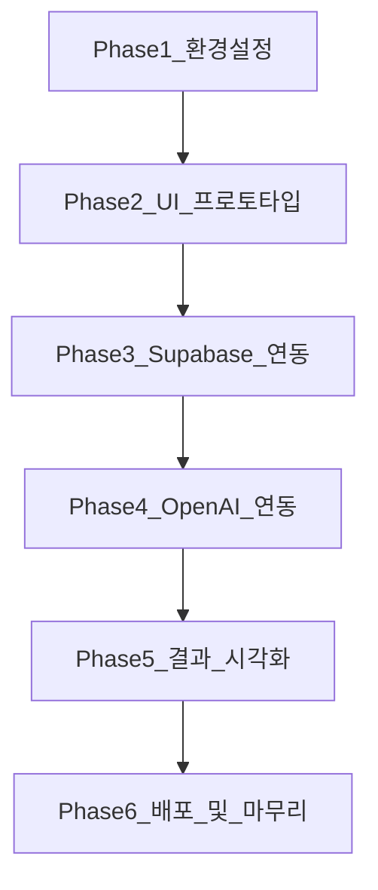
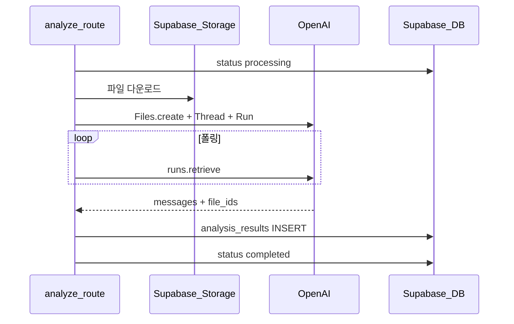

# 03. 개발 계획 (로드맵)

> **이 문서를 읽으면 알 수 있는 것**
>
> - 프로젝트를 **어떤 순서로**, **몇 단계로** 만들지
> - 각 단계가 끝났는지 확인하는 **완료 기준 (체크리스트)**
> - 예상 파일 구조와 **리스크 대응** 방법

---

## 목차

1. [로드맵 개요](#1-로드맵-개요)
2. [Phase 1: 환경 설정](#phase-1-환경-설정)
3. [Phase 2: UI 프로토타입](#phase-2-ui-프로토타입)
4. [Phase 3: Supabase 연동](#phase-3-supabase-연동)
5. [Phase 4: OpenAI 연동](#phase-4-openai-연동)
6. [Phase 5: 결과 시각화](#phase-5-결과-시각화)
7. [Phase 6: 배포 및 마무리](#phase-6-배포-및-마무리)
8. [전체 일정 참고](#8-전체-일정-참고)
9. [리스크 및 대응](#9-리스크-및-대응)

---

## 1. 로드맵 개요



| Phase | 이름 | 핵심 산출물 |
|-------|------|-------------|
| 1 | 환경 설정 | Next.js 프로젝트, `.env.example`, 외부 서비스 계정 |
| 2 | UI 프로토타입 | 업로드·결과·로딩 화면 (목 데이터) |
| 3 | Supabase 연동 | Storage 업로드, DB 스키마, 업로드 API |
| 4 | OpenAI 연동 | 분석 API, Assistant + Code Interpreter |
| 5 | 결과 시각화 | 차트·리포트 UI, 전체 E2E 흐름 |
| 6 | 배포 및 마무리 | Vercel 프로덕션, 보안 점검 |

> **원칙:** UI를 먼저 만들어 "화면 흐름"을 확인한 뒤, 백엔드·AI를 붙입니다. (바이브 코딩 시 방향 확인이 쉬움)

---

## Phase 1: 환경 설정

### 목표

로컬에서 Next.js 개발 서버가 실행되고, Supabase·OpenAI 계정과 환경 변수 골격이 준비된 상태.

### 작업 목록

| # | 작업 | 설명 |
|---|------|------|
| 1.1 | Next.js 프로젝트 생성 | App Router, TypeScript, Tailwind, ESLint |
| 1.2 | 폴더 구조 초기화 | `components/`, `lib/`, `types/`, `hooks/` |
| 1.3 | `.env.example` 작성 | [02_tech_stack.md](./02_tech_stack.md) 변수 목록 |
| 1.4 | Supabase 프로젝트 생성 | Dashboard에서 새 프로젝트, URL·키 복사 |
| 1.5 | OpenAI API 키 발급 | platform.openai.com |
| 1.6 | `.gitignore` 확인 | `.env.local` 제외 |
| 1.7 | README 최소 작성 | 실행 방법 (`npm run dev`) |

### 예상 파일

```
Excel-Analysis/
├── app/
│   ├── layout.tsx
│   ├── page.tsx
│   └── globals.css
├── components/
├── lib/
├── types/
├── docs/
├── .env.example
├── .env.local          # Git 제외
├── package.json
└── tailwind.config.ts
```

### 완료 기준 (체크리스트)

- [ ] `npm run dev` 실행 시 `http://localhost:3000` 접속 가능
- [ ] TypeScript·Tailwind 빌드 오류 없음
- [ ] Supabase·OpenAI 키가 `.env.local`에 설정됨 (값은 비공개)
- [ ] `.env.example`이 Git에 포함됨

---

## Phase 2: UI 프로토타입

### 목표

실제 API 없이도 **업로드 → 분석 중 → 결과** 화면 흐름을 목(mock) 데이터로 확인.

### 작업 목록

| # | 작업 | 설명 |
|---|------|------|
| 2.1 | 공통 레이아웃 | 헤더, 푸터, 반응형 컨테이너 |
| 2.2 | 랜딩 페이지 | 서비스 소개, "시작하기" CTA |
| 2.3 | 업로드 페이지 | `react-dropzone`, 파일 형식·크기 안내 |
| 2.4 | 로딩 UI | 스피너, "AI가 분석 중입니다" 메시지 |
| 2.5 | 결과 페이지 | 요약 텍스트, 차트 placeholder, 목 데이터 |
| 2.6 | 에러 UI | 업로드 실패, 분석 실패 메시지 |

### 예상 파일

```
app/
├── page.tsx                    # 랜딩
├── upload/
│   └── page.tsx                # 업로드
├── analysis/
│   └── [id]/
│       └── page.tsx            # 결과
components/
├── ui/
│   ├── button.tsx
│   └── spinner.tsx
└── features/
    ├── file-uploader.tsx
    ├── analysis-report.tsx
    └── chart-display.tsx
```

### 완료 기준 (체크리스트)

- [ ] `/` → `/upload` → `/analysis/demo-id` 페이지 이동 가능
- [ ] 드래그앤드롭 영역이 동작 (파일 선택만, 업로드 API 없음)
- [ ] 로딩·에러·성공 상태 UI가 디자인 가이드(Tailwind)에 맞게 표시
- [ ] 모바일 너비에서 레이아웃 깨짐 없음

---

## Phase 3: Supabase 연동

### 목표

엑셀 파일이 Supabase Storage에 저장되고, DB에 분석 세션 레코드가 생성됨.

### 작업 목록

| # | 작업 | 설명 |
|---|------|------|
| 3.1 | Storage 버킷 생성 | `excel-uploads`, MIME/크기 정책 |
| 3.2 | DB 스키마 작성 | `analysis_sessions`, `analysis_results` |
| 3.3 | Supabase 클라이언트 | `lib/supabase/client.ts`, `server.ts` |
| 3.4 | 업로드 API | `POST /api/upload` |
| 3.5 | 세션 조회 API | `GET /api/analysis/[id]` |
| 3.6 | UI와 API 연결 | 업로드 성공 시 `session_id`로 결과 페이지 이동 |

### DB 스키마 (초안)

```sql
-- analysis_sessions: 한 번의 업로드·분석 단위
CREATE TABLE analysis_sessions (
  id UUID PRIMARY KEY DEFAULT gen_random_uuid(),
  file_name TEXT NOT NULL,
  storage_path TEXT NOT NULL,
  file_size BIGINT,
  mime_type TEXT,
  status TEXT NOT NULL DEFAULT 'pending'
    CHECK (status IN ('pending', 'processing', 'completed', 'failed')),
  error_message TEXT,
  created_at TIMESTAMPTZ DEFAULT NOW(),
  updated_at TIMESTAMPTZ DEFAULT NOW()
);

-- analysis_results: AI 분석 결과
CREATE TABLE analysis_results (
  id UUID PRIMARY KEY DEFAULT gen_random_uuid(),
  session_id UUID NOT NULL REFERENCES analysis_sessions(id) ON DELETE CASCADE,
  summary TEXT,
  chart_urls TEXT[],           -- Storage URL 배열
  metadata JSONB DEFAULT '{}', -- 추가 통계, 컬럼 정보 등
  raw_response TEXT,           -- 디버깅용 (선택)
  created_at TIMESTAMPTZ DEFAULT NOW()
);

CREATE INDEX idx_sessions_status ON analysis_sessions(status);
CREATE INDEX idx_results_session ON analysis_results(session_id);
```

### 예상 API

| Method | Path | Body | Response |
|--------|------|------|----------|
| POST | `/api/upload` | `FormData` (file) | `{ sessionId, fileName }` |
| GET | `/api/analysis/[id]` | - | `{ session, result? }` |

### 완료 기준 (체크리스트)

- [ ] `.xlsx` / `.csv` 업로드 후 Supabase Storage에 파일 존재
- [ ] `analysis_sessions` 테이블에 `pending` 레코드 생성
- [ ] 잘못된 확장자 업로드 시 400 에러와 UI 메시지
- [ ] Supabase Dashboard에서 데이터 확인 가능

---

## Phase 4: OpenAI 연동

### 목표

업로드된 파일을 OpenAI Assistants + Code Interpreter로 분석하고, 텍스트 결과를 DB에 저장.

### 작업 목록

| # | 작업 | 설명 |
|---|------|------|
| 4.1 | OpenAI 클라이언트 | `lib/openai/client.ts` |
| 4.2 | Assistant 설정 | Code Interpreter 활성화, 시스템 지시문(한국어 리포트) |
| 4.3 | 파일 → OpenAI Files API | Storage에서 다운로드 후 업로드 |
| 4.4 | Thread / Run 생성 | 분석 프롬프트 전송 |
| 4.5 | Run 폴링 | `completed` / `failed`까지 상태 확인 |
| 4.6 | 분석 API | `POST /api/analyze` `{ sessionId }` |
| 4.7 | 결과 DB 저장 | `analysis_results`, `status: completed` |

### 분석 API 흐름



### Assistant 시스템 지시문 (예시)

```
당신은 데이터 분석 전문가입니다.
업로드된 스프readsheet를 pandas로 읽고,
- 데이터 개요 (행/열 수, 컬럼 타입)
- 주요 통계 (합계, 평균, 결측치)
- 인사이트 3가지
- 적절한 차트 1~2개 (matplotlib)
를 한국어로 제공하세요.
```

### 완료 기준 (체크리스트)

- [ ] 샘플 엑셀(10~100행) 업로드 후 분석 API 호출 성공
- [ ] OpenAI 응답 텍스트가 `analysis_results.summary`에 저장
- [ ] 실패 시 `status: failed`, `error_message` 저장
- [ ] 분석 중 UI에 로딩 상태 표시 (폴링 또는 SSE)

---

## Phase 5: 결과 시각화

### 목표

AI가 생성한 차트·요약을 사용자 친화적인 리포트 UI로 표시.

### 작업 목록

| # | 작업 | 설명 |
|---|------|------|
| 5.1 | 차트 이미지 처리 | OpenAI 생성 파일 다운로드 → Storage 저장 → URL |
| 5.2 | `chart-display.tsx` | 이미지 갤러리, 확대 보기 |
| 5.3 | `analysis-report.tsx` | Markdown/HTML 요약 렌더링 |
| 5.4 | Recharts 연동 (선택) | AI JSON 메타데이터 → 인터랙티브 차트 |
| 5.5 | 결과 페이지 실데이터 | mock 제거, API 연동 |
| 5.6 | E2E 수동 테스트 | 업로드 → 분석 → 결과 전체 흐름 |

### 완료 기준 (체크리스트)

- [ ] 결과 페이지에 AI 요약 텍스트 표시
- [ ] 차트 이미지 1개 이상 표시
- [ ] `failed` 세션에서 재시도 또는 안내 문구 표시
- [ ] 분석 완료까지 end-to-end 1회 이상 성공

---

## Phase 6: 배포 및 마무리

### 목표

Vercel 프로덕션 URL에서 서비스 동작, 기본 보안·운영 준비.

### 작업 목록

| # | 작업 | 설명 |
|---|------|------|
| 6.1 | GitHub 저장소 push | Vercel 연동 |
| 6.2 | Vercel 환경 변수 | 모든 시크릿 등록 |
| 6.3 | Supabase RLS (기본) | anon key 노출 대비 정책 |
| 6.4 | 파일 크기·Rate limit | 업로드 10MB 등 제한 |
| 6.5 | 에러 로깅 | `console.error` → 추후 Sentry |
| 6.6 | 프로덕션 smoke test | 실제 URL에서 업로드·분석 |

### 완료 기준 (체크리스트)

- [ ] `https://xxx.vercel.app` 에서 랜딩·업로드 접근
- [ ] 프로덕션에서 샘플 파일 분석 1회 성공
- [ ] `.env.local` / API 키가 저장소에 없음
- [ ] (선택) Supabase Auth 도입 계획 문서화

---

## 8. 전체 일정 참고

비개발자 1명 + AI 페어 프로그래밍 기준 **대략적** 참고입니다. 실제 일정은 파일 크기·OpenAI 응답 속도에 따라 달라집니다.

| Phase | 예상 기간 |
|-------|-----------|
| Phase 1 | 0.5 ~ 1일 |
| Phase 2 | 1 ~ 2일 |
| Phase 3 | 1 ~ 2일 |
| Phase 4 | 2 ~ 3일 |
| Phase 5 | 1 ~ 2일 |
| Phase 6 | 0.5 ~ 1일 |
| **합계** | **약 6 ~ 11일** |

---

## 9. 리스크 및 대응

| 리스크 | 영향 | 대응 |
|--------|------|------|
| OpenAI API 비용 | 예산 초과 | Usage 대시보드 모니터링, 파일 크기·행 수 제한 |
| 분석 시간 1~3분+ | 사용자 이탈 | 로딩 UI, 진행 메시지, 비동기 폴링 |
| 대용량 엑셀 (수만 행) | 타임아웃·비용 | MVP: 10MB / 1만 행 제한 안내 |
| Code Interpreter 실패 | 빈 결과 | 재시도 버튼, `failed` 상태 + 원인 메시지 |
| Supabase 무료 한도 | Storage/DB 초과 | 오래된 세션 정리 Job (2차) |
| API 키 유출 | 보안 사고 | 서버 전용, Vercel 시크릿, 키 로테이션 |

---

## 다음 단계

Phase 1을 시작하려면 채팅에서 **「진행해」**라고 입력하세요.  
Next.js 초기 세팅부터 진행합니다.

---

## 관련 문서

- [01_system_architecture.md](./01_system_architecture.md)
- [02_tech_stack.md](./02_tech_stack.md)
- [04_coding_guideline.md](./04_coding_guideline.md)
