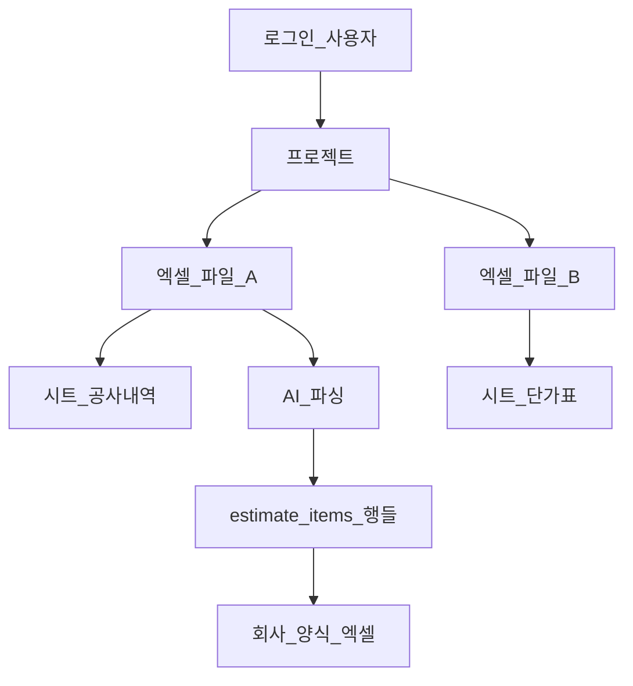
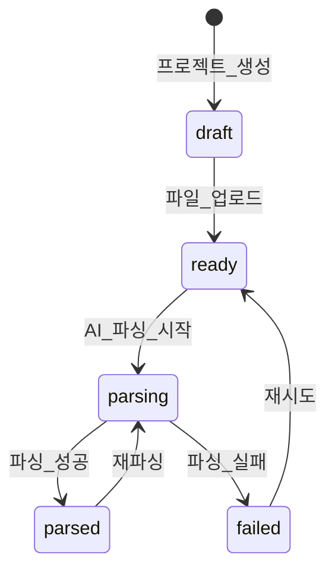

# 05. 시스템 요구사항 (기능 명세서 v2)

> **이 문서를 읽으면 알 수 있는 것**
>
> - AI 엑셀 분석 시스템이 **무엇을**, **누구를 위해**, **어떻게** 동작해야 하는지
> - **데이터 자산화**와 **정형 엑셀 Export** 중심의 기능 목록
> - 타겟 사용자별 **시나리오**와 우선순위

---

## 목차

1. [문서 개요](#1-문서-개요)
2. [서비스 목적](#2-서비스-목적)
3. [타겟 사용자](#3-타겟-사용자)
4. [핵심 개념: 프로젝트(Project)](#4-핵심-개념-프로젝트project)
5. [취급 데이터 정의](#5-취급-데이터-정의)
6. [기능 요구사항 (FR)](#6-기능-요구사항-fr)
7. [비기능 요구사항 (NFR)](#7-비기능-요구사항-nfr)
8. [사용자 시나리오](#8-사용자-시나리오)
9. [화면 흐름](#9-화면-흐름)
10. [AI 파싱 요구사항](#10-ai-파싱-요구사항)
11. [1차 릴리스 범위와 2차 확장](#11-1차-릴리스-범위와-2차-확장)
12. [구 아키텍처와의 관계](#12-구-아키텍처와의-관계)

---

## 1. 문서 개요

| 항목 | 내용 |
|------|------|
| 문서 버전 | **2.0** (구조화 데이터 자산화) |
| 기준일 | 2025년 |
| 관련 DB 설계 | [06_database_schema.md](./06_database_schema.md) |
| 마이그레이션 SQL | [08_new_schema_migration.sql](./08_new_schema_migration.sql) |
| 인증 정책 | **Supabase Auth 로그인 필수** — 본인 프로젝트만 접근 |

---

## 2. 서비스 목적

### 2.1 한 줄 정의

> **공사·견적 엑셀을 AI로 정형 데이터로 변환·DB 저장하고, 웹에서 편집·검증한 뒤 회사 양식 엑셀로 Export하는 웹 서비스**

### 2.2 해결하려는 문제

| 현재 (수동) | 본 서비스 (자동) |
|-------------|------------------|
| 복잡한 내역서를 일일이 열어 항목 복사 | AI가 **품명·수량·단가** 등을 자동 추출 |
| 파일마다 형식이 달라 비교·집계 어려움 | DB **통일 스키마**(`estimate_items`)로 저장 |
| 수정 후 다시 엑셀에 붙여넣기 | 웹 **표에서 직접 편집** |
| 고객 제출용 양식으로 재작성 | **Export 버튼**으로 회사 양식 생성 |

### 2.3 핵심 가치

1. **데이터 자산화** — 엑셀 내용이 DB 행으로 영구 저장
2. **정확성** — AI 추출 + 사람 검증·수정
3. **실무 활용** — 편집 가능한 표 + Export
4. **속도** — 채팅/Code Interpreter 대비 **빠른 Structured Output**

---

## 3. 타겟 사용자

| 페르소나 | 역할 | 주요 니즈 | 자주 쓰는 기능 |
|----------|------|-----------|----------------|
| **김설계** (시스템 설계자) | 장비 사양·모델 검토 | 추출 데이터 정합성, 규격 수정 | 파싱, 테이블 편집 |
| **박PM** (프로젝트 PM) | 견적·내역 종합 | 고객 제출용 엑셀 생성 | Export, 파싱 이력 |
| **이영업** (영업 담당) | 가격·수량 비교 | 제조사별 단가 확인 | 테이블 필터, Export |

### 공통 요구

- **한국어 UI**
- 로그인 후 **본인 프로젝트만** 접근
- **업로드 → 파싱 → 편집 → Export** 4단계

---

## 4. 핵심 개념: 프로젝트(Project)

### 4.1 프로젝트란?

**프로젝트** = 하나의 견적·내역 검토 **업무 단위**.

| 비유 | 실제 |
|------|------|
| 업무 폴더 | `projects` 1건 |
| 폴더 안 엑셀 | `project_files` N건 |
| 시트 탭 정보 | `file_sheets` M건 |
| AI 파싱 작업 | `parse_jobs` 1회 |
| 추출된 항목 장부 | `estimate_items` (행 N개) |

### 4.2 구조 다이어그램



### 4.3 프로젝트 생명주기



---

## 5. 취급 데이터 정의

### 5.1 입력 파일

| 형식 | 설명 |
|------|------|
| `.xlsx` | Excel 2007+ (주력) |
| `.csv` | UTF-8 CSV (보조) |

### 5.2 추출 대상 필드 (estimate_items)

| 필드 (DB) | 한글명 | 예시 |
|-----------|--------|------|
| `category` | 공종 | 전기, 토목 |
| `item_name` | 품명 | LED 디스플레이 |
| `specification` | 규격 | 55inch 4K |
| `manufacturer` | 제조사 | A사 |
| `quantity` | 수량 | 2 |
| `unit` | 단위 | EA |
| `unit_price` | 단가 | 1,500,000 |
| `total_amount` | 합계 | 3,000,000 |
| `remark` | 비고 | 설치비 포함 |
| `extra_fields` | 기타 | 매핑 안 된 열 |

### 5.3 Export 출력

- **형식:** `.xlsx` (회사 지정 양식)
- **데이터 원천:** `estimate_items` (사용자 편집 반영)
- **파일명 예:** `{프로젝트명}_Export_{날짜}.xlsx`

---

## 6. 기능 요구사항 (FR)

| ID | 기능 | 설명 | 우선순위 |
|----|------|------|----------|
| **FR-01** | 회원가입/로그인 | Supabase Auth, 미로그인 시 접근 불가 | P0 |
| **FR-02** | 프로젝트 CRUD | 생성·조회·수정·삭제, 본인만 | P0 |
| **FR-03** | 파일 업로드 | `.xlsx`/`.csv`, Storage + `project_files` + `file_sheets` | P0 |
| **FR-04** | AI 구조화 파싱 | OpenAI Structured Output → `estimate_items` INSERT | P0 |
| **FR-05** | 데이터 테이블 UI | 조회·정렬·필터·페이지네이션 | P0 |
| **FR-06** | 행 CRUD | 항목 추가·수정·삭제, `is_manually_edited` 표시 | P0 |
| **FR-07** | 엑셀 Export | DB → 회사 양식 `.xlsx` 다운로드 | P0 |
| **FR-08** | 파싱 이력 | `parse_jobs` 조회, 재파싱 | P1 |
| **FR-09** | Export 템플릿 | 양식 종류 선택 (회사별) | P2 |

### FR-04 상세 (AI 파싱)

| 항목 | 요구 |
|------|------|
| 트리거 | "AI 파싱" 버튼 (파일 단위 또는 프로젝트 전체) |
| 처리 | Storage → xlsx 읽기 → OpenAI JSON Schema → DB INSERT |
| 성공 | `parse_jobs.status = completed`, `projects.status = parsed` |
| 실패 | `parse_jobs.status = failed`, 한국어 `error_message` |
| 재파싱 | 기존 `estimate_items` 삭제 후 재추출 (확인 다이얼로그) |

### FR-07 상세 (Export)

| 항목 | 요구 |
|------|------|
| 트리거 | "엑셀 다운로드" 버튼 |
| 입력 | `estimate_items` (프로젝트 전체 또는 필터 결과) |
| 출력 | 회사 헤더·서식이 적용된 `.xlsx` |
| 편집 반영 | Export 직전 DB 최신값 사용 |

---

## 7. 비기능 요구사항 (NFR)

| ID | 항목 | 요구 |
|----|------|------|
| NFR-01 | 언어 | UI·에러 메시지 **한국어** |
| NFR-02 | 보안 | API 키 서버 전용, RLS 적용 |
| NFR-03 | 파일 크기 | 업로드 **10MB** 이하 |
| NFR-04 | 파싱 속도 | 일반 내역서(100~500행) **60초 이내** 목표 |
| NFR-05 | 가용성 | Vercel + Supabase 클라우드 |
| NFR-06 | 브라우저 | Chrome, Edge 최신 2버전 |

---

## 8. 사용자 시나리오

### 시나리오 1 — 김설계: 파싱 후 규격 수정

**Given** — 김설계가 로그인했고, POSCO 견적 프로젝트를 만들었다.  
**When** — `(제출)_POSCO_내역.xlsx` 업로드 → "AI 파싱" 클릭  
**Then** — `estimate_items` 표에 품명·규격·수량이 표시된다.  
**When** — 규격 열에서 `55inch` → `55inch 4K UHD` 수정 후 저장  
**Then** — `is_manually_edited = true`로 표시, Export 시 반영된다.

### 시나리오 2 — 박PM: 고객 제출용 Export

**Given** — 파싱·편집이 완료된 프로젝트 (`status = parsed`)  
**When** — "엑셀 다운로드" 클릭  
**Then** — 회사 양식 `.xlsx`가 브라우저에 다운로드된다.  
**And** — 파일을 열면 품명·수량·단가·합계 열이 정렬되어 있다.

### 시나리오 3 — 이영업: 제조사별 필터 후 Export

**Given** — `estimate_items`에 A사·B사 항목이 섞여 있다.  
**When** — 테이블에서 제조사 = "A사" 필터 적용  
**Then** — A사 항목만 표시된다.  
**When** — "선택 항목 Export" (P1) 또는 전체 Export  
**Then** — 필터된 데이터만 엑셀에 포함된다.

---

## 9. 화면 흐름

### 9.1 라우트

| 경로 | 화면 | 설명 |
|------|------|------|
| `/login` | 로그인 | Auth |
| `/` | 대시보드 | 프로젝트 요약 |
| `/projects` | 프로젝트 목록 | CRUD |
| `/projects/[id]` | **작업 공간** | 업로드 + 파싱 + 테이블 + Export |
| `/settings` | 설정 | 프로필 (선택) |

### 9.2 작업 공간 레이아웃 (`/projects/[id]`)

```
┌─────────────────────────────────────────────────┐
│  프로젝트명 · 상태 뱃지                            │
├──────────────────────┬──────────────────────────┤
│  파일 업로드 패널      │  [AI 파싱] [엑셀 Export]   │
│  (드래그앤드롭)        │  ─────────────────────    │
│  업로드된 파일 목록    │  estimate_items 데이터表  │
│                      │  (정렬·필터·인라인 편집)    │
└──────────────────────┴──────────────────────────┘
```

> **폐기:** AI 채팅 패널 (우측) — v2에서 제거

---

## 10. AI 파싱 요구사항

### 10.1 API 방식

| 항목 | 값 |
|------|-----|
| OpenAI API | **Chat Completions** |
| 출력 형식 | **`response_format: json_schema`** (Structured Output) |
| 모델 | `gpt-4o` (또는 `gpt-4o-mini` — 속도·비용 트레이드오프) |

### 10.2 JSON Schema (추출 필드)

```json
{
  "type": "object",
  "properties": {
    "items": {
      "type": "array",
      "items": {
        "type": "object",
        "properties": {
          "sheet_name": { "type": "string" },
          "source_row_index": { "type": "integer" },
          "category": { "type": "string" },
          "item_name": { "type": "string" },
          "specification": { "type": "string" },
          "manufacturer": { "type": "string" },
          "quantity": { "type": "number" },
          "unit": { "type": "string" },
          "unit_price": { "type": "number" },
          "total_amount": { "type": "number" },
          "remark": { "type": "string" },
          "extra_fields": { "type": "object" }
        },
        "required": ["item_name"]
      }
    }
  },
  "required": ["items"]
}
```

### 10.3 컬럼 매핑 규칙

AI 시스템 지시문에 포함할 매핑 힌트:

| 엑셀 헤더 예시 | DB 필드 |
|----------------|---------|
| 품명, 품목, Item | `item_name` |
| 규격, 사양, Spec | `specification` |
| 제조사, 메이커, Maker | `manufacturer` |
| 수량, Qty | `quantity` |
| 단위, Unit | `unit` |
| 단가, Unit Price | `unit_price` |
| 금액, 합계, Amount | `total_amount` |
| 공종, 분류 | `category` |
| 비고, Remark | `remark` |

### 10.4 전처리·예외

| 상황 | 처리 |
|------|------|
| 병합 셀 | 서버에서 xlsx 파싱 시 가능한 범위 전개 |
| 빈 행 | 추출 대상에서 제외 |
| 헤더 없음 | `file_sheets.column_headers` + AI 추론 |
| `.xls` (구형) | 업로드 거부, `.xlsx` 변환 안내 |
| 파싱 0행 | `failed` + "추출된 항목이 없습니다" |

---

## 11. 1차 릴리스 범위와 2차 확장

### 11.1 1차 릴리스 (MVP) — P0

- [ ] Supabase Auth
- [ ] 프로젝트 CRUD
- [ ] 파일 업로드
- [ ] AI Structured Output 파싱
- [ ] `estimate_items` 테이블 UI + CRUD
- [ ] 회사 기본 양식 Export

### 11.2 2차 확장 (P1 이후)

| 기능 | 설명 |
|------|------|
| 파싱 이력 UI | `parse_jobs` 목록·재파싱 |
| 다중 Export 템플릿 | 회사·고객별 양식 |
| 일괄 수정 | 선택 행 단가 일괄 변경 |
| 파일 간 교차 비교 | 동일 품명 매칭 (규칙 기반) |
| 감사 로그 | 누가 언제 수정했는지 |

---

## 12. 구 아키텍처와의 관계

| 구 기능 (v1) | v2 대체 |
|--------------|---------|
| AI 채팅 | **데이터 테이블 + 파싱 버튼** |
| Code Interpreter | **Structured Output** |
| `analysis_results` 리포트 | **`estimate_items` 행** |
| 차트 PNG | Export 엑셀 (P0), 차트 (P2) |

> 신규 개발은 [06_database_schema.md](./06_database_schema.md) v2 및 [03_development_plan.md](./03_development_plan.md) Phase 4~8을 따릅니다.

---

## 관련 문서

- [01_system_architecture.md](./01_system_architecture.md) — 아키텍처·데이터 흐름
- [06_database_schema.md](./06_database_schema.md) — DB 설계
- [03_development_plan.md](./03_development_plan.md) — 개발 로드맵
- [08_new_schema_migration.sql](./08_new_schema_migration.sql) — SQL 마이그레이션
