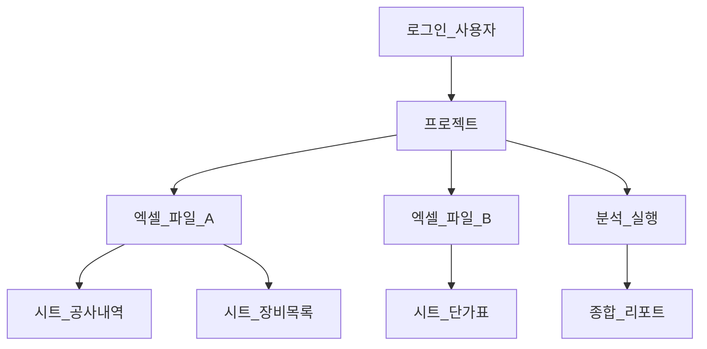
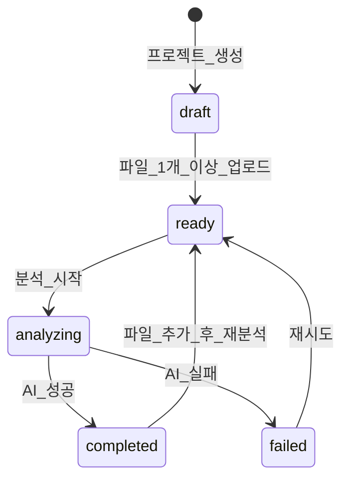
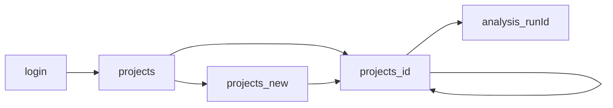
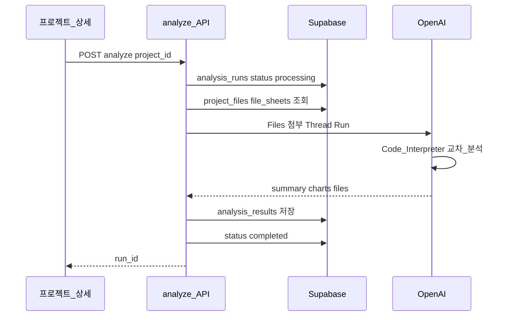

# 05. 시스템 요구사항 (기능 명세서)

> **이 문서를 읽으면 알 수 있는 것**
>
> - AI 엑셀 분석 시스템이 **무엇을**, **누구를 위해**, **어떻게** 동작해야 하는지
> - **프로젝트** 단위로 여러 파일·시트를 묶어 교차 분석하는 핵심 개념
> - 타겟 사용자(설계자, PM, 영업)별 **사용자 시나리오**와 기능 우선순위

---

## 목차

1. [문서 개요](#1-문서-개요)
2. [서비스 목적](#2-서비스-목적)
3. [타겟 사용자](#3-타겟-사용자)
4. [핵심 개념: 프로젝트(Project)](#4-핵심-개념-프로젝트project)
5. [취급 데이터 정의](#5-취급-데이터-정의)
6. [기능 요구사항 (FR)](#6-기능-요구사항-fr)
7. [비기능 요구사항 (NFR)](#7-비기능-요구사항-nfr)
8. [사용자 시나리오](#8-사용자-시나리오)
9. [화면 흐름](#9-화면-흐름)
10. [AI 분석 요구사항](#10-ai-분석-요구사항)
11. [1차 릴리스 범위와 2차 확장](#11-1차-릴리스-범위와-2차-확장)
12. [기존 문서와의 관계](#12-기존-문서와의-관계)

---

## 1. 문서 개요

본 문서는 **AI 엑셀 자동 분석 및 시각화 웹 서비스**의 확정된 비즈니스 요구사항을 기능 명세 형태로 정리한 것입니다.

| 항목 | 내용 |
|------|------|
| 문서 버전 | 1.0 |
| 기준일 | 2025년 |
| 관련 DB 설계 | [06_database_schema.md](./06_database_schema.md) |
| 인증 정책 | **Supabase Auth 로그인 필수** — 본인 프로젝트만 접근 |

---

## 2. 서비스 목적

### 2.1 한 줄 정의

> **공사·장비 견적 관련 여러 엑셀 파일과 시트를 AI가 한 번에 종합 분석하여, 교차 비교·요약 리포트를 제공하는 웹 서비스**

### 2.2 해결하려는 문제

| 현재 (수동) | 본 서비스 (자동) |
|-------------|------------------|
| 공사내역서·단가표·장비 목록을 파일마다 따로 열어봄 | 프로젝트 단위로 **한 화면에서 종합** |
| 시트가 여러 개일 때 누락·중복 검토 어려움 | **다중 Sheet 메타데이터**를 AI에 전달해 빠짐없이 분석 |
| 모델·사양·가격 교차 비교에 시간 소요 | **교차 분석 리포트**와 차트로 즉시 인사이트 |
| 분석 결과가 개인 PC·메일에 흩어짐 | DB에 **분석 이력** 저장, 재조회 가능 |

### 2.3 핵심 가치

1. **종합성** — N개 파일 × M개 시트를 하나의 분석 단위로 처리
2. **교차 분석** — 파일·시트 간 메이커, 모델, 사양, 수량, 가격 비교
3. **접근성** — 비개발자(PM, 영업, 설계자)도 웹 UI만으로 활용
4. **추적성** — 프로젝트·분석 실행 단위로 이력 관리

---

## 3. 타겟 사용자

### 3.1 페르소나 요약

| 페르소나 | 역할 | 주요 니즈 | 자주 쓰는 기능 |
|----------|------|-----------|----------------|
| **김설계** (시스템 설계자) | 장비 사양·모델 매칭, 데이터 정합성 검토 | 시트 간 모델/사양 불일치 탐지, 컬럼 구조 파악 | 교차 비교 리포트, 컬럼 매핑 요약 |
| **박PM** (프로젝트 PM) | 견적·내역 종합, 일정·리스크 관리 | 프로젝트 전체 현황 한눈에 파악 | 프로젝트 CRUD, 종합 리포트, 분석 상태 |
| **이영업** (영업 담당자) | 고객 제안, 가격·수량 비교 | 메이커별 단가, 핵심 수치 추출 | 가격 비교 차트, 요약 텍스트 |

### 3.2 공통 요구

- **한국어 UI** 및 **한국어 분석 리포트**
- 로그인 후 **본인이 만든 프로젝트만** 조회·수정·삭제
- 복잡한 엑셀 수식 지식 없이 **업로드 → 분석 → 결과** 3단계

---

## 4. 핵심 개념: 프로젝트(Project)

### 4.1 프로젝트란?

**프로젝트**는 하나의 **업무·검토 단위**입니다. 여러 엑셀 파일을 하나의 폴더처럼 묶어, AI가 **한 번에 종합 분석**합니다.

| 비유 | 실제 |
|------|------|
| 업무 폴더 | `projects` 테이블 레코드 1건 |
| 폴더 안의 엑셀 파일들 | `project_files` (N건) |
| 각 파일의 시트 탭 | `file_sheets` (M건) |
| "전체 분석 실행" 버튼 | `analysis_runs` 1회 실행 |
| AI가 만든 종합 보고서 | `analysis_results` 1건 |

### 4.2 구조 다이어그램



### 4.3 프로젝트 생명주기



| 상태 | 의미 | 사용자 행동 |
|------|------|-------------|
| `draft` | 생성 직후, 파일 없음 | 파일 업로드 |
| `ready` | 분석 가능 | "전체 분석" 클릭 |
| `analyzing` | AI 처리 중 | 대기 UI |
| `completed` | 최근 분석 성공 | 리포트 확인 |
| `failed` | 분석 실패 | 오류 확인 후 재시도 |

### 4.4 단일 파일 vs 프로젝트 (설계 변경 포인트)

| 구분 | 구버전 (01, 03 문서) | **본 요구사항 (신규 기준)** |
|------|----------------------|----------------------------|
| 분석 단위 | 파일 1개 = 세션 1개 | **프로젝트 1개 = 파일 N개** |
| 시트 | 암묵적 1시트 가정 | **시트별 메타데이터 명시** |
| 사용자 | 세션 ID (익명) | **로그인 필수** |
| 결과 | 단일 파일 요약 | **교차 분석 종합 리포트** |

---

## 5. 취급 데이터 정의

### 5.1 도메인 키워드

본 시스템이 다루는 엑셀 데이터의 **대표 컬럼·개념**입니다. AI 프롬프트와 UI 라벨에 공통으로 사용합니다.

| 키워드 | 설명 | 예시 |
|--------|------|------|
| **공사내역서** | 공종·항목·물량·단가가 정리된 견적/내역 문서 | 토목공사 내역, 전기공사 내역 |
| **메이커** | 장비 제조사·브랜드 | A사, B사 |
| **모델** | 장비 모델명·형번 | XX-100, YY-200A |
| **사양** | 규격·스펙·성능 | 출력 kW, 용량, 재질 |
| **수량** | EA, SET, m, kg 등 단위 수량 | 10 EA |
| **가격** | 단가, 금액, 합계 | 1,500,000원 |

### 5.2 지원 파일 형식

| 형식 | 1차 릴리스 | 비고 |
|------|------------|------|
| `.xlsx` | 지원 | 다중 Sheet 파싱 |
| `.csv` | 지원 | 단일 "시트"로 취급 |
| `.xls` | 미지원 (2차) | 레거시 형식 |

### 5.3 데이터 품질 가정

- 헤더 행이 존재한다고 가정 (1행 또는 AI가 탐지)
- 컬럼명이 파일·시트마다 다를 수 있음 → AI가 **의미 매핑** 수행
- 병합 셀·빈 행이 있을 수 있음 → Code Interpreter가 전처리

---

## 6. 기능 요구사항 (FR)

### 6.1 기능 목록

| ID | 기능명 | 설명 | 우선순위 |
|----|--------|------|----------|
| **FR-01** | 회원가입/로그인 | Supabase Auth (이메일 등), 미로그인 시 프로젝트 접근 불가 | P0 |
| **FR-02** | 프로젝트 CRUD | 생성, 이름·설명 수정, 목록 조회, 삭제 | P0 |
| **FR-03** | 다중 파일 업로드 | 프로젝트당 `.xlsx`, `.csv` 여러 개 드래그앤드롭 | P0 |
| **FR-04** | 시트 메타데이터 수집 | 업로드 시 시트명·헤더·행 수 등 DB 저장 | P0 |
| **FR-05** | 종합 AI 분석 | 프로젝트 내 **전체 파일·시트**를 OpenAI에 전달해 교차 분석 | P0 |
| **FR-06** | 종합 리포트 표시 | 요약, 교차 비교, 인사이트, 차트를 한 화면에 표시 | P0 |
| **FR-07** | 분석 이력 | 동일 프로젝트 재분석 시 `analysis_runs` 이력 조회 | P1 |
| **FR-08** | 파일 개별 삭제 | 프로젝트 내 특정 파일만 제거 | P1 |
| **FR-09** | 프로필 | 표시 이름, (선택) 역할(designer/pm/sales) | P1 |

### 6.2 FR-03 다중 파일 업로드 (상세)

| 항목 | 요구사항 |
|------|----------|
| 업로드 방식 | 드래그앤드롭 + 파일 선택, **다중 선택** |
| 프로젝트당 파일 수 | 1차: 최대 **10개** (조정 가능) |
| 파일당 크기 | 최대 **10MB** |
| 중복 파일명 | 같은 프로젝트 내 동일 파일명 업로드 시 번호 접미 또는 거부 (구현 시 결정) |
| 업로드 후 | 파일 목록 + 각 파일의 **시트 개수·시트명** UI 표시 |

### 6.3 FR-05 종합 AI 분석 (상세)

| 항목 | 요구사항 |
|------|----------|
| 트리거 | 프로젝트 상세 화면 "전체 분석 시작" 버튼 |
| 입력 | 프로젝트에 속한 **모든** `project_files` + `file_sheets` 메타 |
| 처리 | OpenAI Assistants + Code Interpreter, 프로젝트 파일 일괄 첨부 |
| 출력 | `analysis_results`: summary, cross_analysis, insights, chart_urls |
| 실패 | `analysis_runs.status = failed`, 한국어 `error_message` |

### 6.4 FR-06 종합 리포트 (상세)

리포트는 다음 **섹션**을 포함합니다.

| 섹션 | 내용 |
|------|------|
| **Executive Summary** | 3~5문장 전체 요약 |
| **데이터 개요** | 파일 수, 시트 수, 주요 컬럼 |
| **교차 분석** | 파일·시트 간 모델/사양/가격/수량 비교표 또는 서술 |
| **인사이트** | 불일치, 이상치, 주의 항목 bullet |
| **차트** | AI 생성 PNG (막대·파이·비교 등) |

---

## 7. 비기능 요구사항 (NFR)

| ID | 영역 | 요구사항 |
|----|------|----------|
| **NFR-01** | 보안 | OpenAI·Service Role 키는 서버(API Route)에서만 사용 |
| **NFR-02** | 보안 | RLS로 타 사용자 프로젝트·파일 접근 차단 |
| **NFR-03** | 성능 | 단일 프로젝트 분석 5분 이내 목표 (파일·행 수에 따라 변동) |
| **NFR-04** | 용량 | 프로젝트당 총 업로드 50MB 이하 권장 (1차) |
| **NFR-05** | UX | 분석 중 로딩·진행 메시지, 실패 시 재시도 안내 |
| **NFR-06** | i18n | UI·에러·AI 리포트 **한국어** |
| **NFR-07** | 가용성 | Vercel + Supabase SLA 범위 내 |
| **NFR-08** | 비용 | OpenAI Usage 모니터링, 프로젝트당 분석 횟수 제한 검토 (2차) |

---

## 8. 사용자 시나리오

시나리오는 **Given(전제) — When(행동) — Then(결과)** 형식입니다.

---

### SC-01: PM — 견적 종합 리포트

| 항목 | 내용 |
|------|------|
| **페르소나** | 박PM (프로젝트 PM) |
| **목표** | OO공사 견적 관련 여러 내역서를 한 번에 종합 검토 |

**Given**

- 박PM은 로그인된 상태이다.
- "OO공사 2025 견적 검토" 프로젝트를 생성했다.

**When**

1. 공사내역서 `내역_A.xlsx` (시트: 토목, 전기), `내역_B.xlsx` (시트: Summary) 업로드
2. 장비 단가표 `단가표_메이커별.xlsx` (시트: A사, B사, C사) 업로드
3. "전체 분석 시작" 클릭
4. 분석 완료 후 리포트 페이지 이동

**Then**

- Executive Summary에 **전체 공사 규모·주요 장비·가격 범위**가 한국어로 요약된다.
- 교차 분석 섹션에서 **메이커·모델·수량·가격**이 파일·시트 간 비교된다.
- 차트 1개 이상(예: 메이커별 금액 비교)이 표시된다.
- 프로젝트 상태가 `completed`로 갱신된다.

---

### SC-02: 설계자 — 사양·모델 불일치 탐지

| 항목 | 내용 |
|------|------|
| **페르소나** | 김설계 (시스템 설계자) |
| **목표** | 동일 장비에 대해 파일·시트 간 모델/사양 불일치 확인 |

**Given**

- 김설계가 PM이 공유한(동일 계정 또는 추후 팀 공유) 프로젝트를 연다.
- 프로젝트에 장비 목록 시트와 공사내역 시트가 포함되어 있다.

**When**

1. "전체 분석 시작" (또는 기존 completed 리포트 조회)
2. 리포트의 **교차 분석** 및 **인사이트** 섹션 확인

**Then**

- AI가 **모델명·사양 불일치** 후보를 bullet로 나열한다 (예: "A시트 모델 XX-100 vs B시트 XX-100A").
- 컬럼 매핑 요약(어느 시트에 '모델', '사양' 컬럼이 있는지)이 제공된다.
- 불일치가 없으면 "주요 불일치 없음" 등으로 명시된다.

---

### SC-03: 영업 — 메이커별 가격 비교

| 항목 | 내용 |
|------|------|
| **페르소나** | 이영업 (영업 담당자) |
| **목표** | 고객 미팅 전 메이커별 단가·수량 핵심 수치 추출 |

**Given**

- 이영업이 "XX 프로젝트 입찰" 프로젝트에 메이커별 단가 엑셀 3개를 업로드했다.

**When**

1. 전체 분석 실행
2. 리포트 및 차트 확인

**Then**

- 메이커별 **총액·평균 단가·수량 합계**가 요약된다.
- 비교 막대 차트 등 시각 자료가 생성된다.
- 영업용 3~5개 **핵심 수치**가 인사이트에 bullet로 정리된다.

---

### SC-04: 오류 — 지원하지 않는 파일 형식

| 항목 | 내용 |
|------|------|
| **페르소나** | 모든 사용자 |
| **목표** | 잘못된 업로드 시 명확한 안내 |

**Given**

- 사용자가 프로젝트 상세 화면에 있다.

**When**

- `.pdf` 또는 `.xls` 파일을 업로드 시도

**Then**

- 업로드가 **거부**되고, "`.xlsx`, `.csv`만 지원합니다`" 등 **한국어 에러** 표시
- DB·Storage에 해당 파일이 저장되지 않음

---

### SC-05: 재분석 — 파일 추가 후 이력 유지 (P1)

**Given** — completed 상태 프로젝트에 새 파일 1개 추가  
**When** — "전체 분석 시작" 재실행  
**Then** — 새 `analysis_runs` 레코드 생성, 이전 run 이력 목록에서 조회 가능

---

## 9. 화면 흐름

### 9.1 라우트 구조 (예정)

| 경로 | 화면 | 설명 |
|------|------|------|
| `/login` | 로그인 | Supabase Auth |
| `/projects` | 프로젝트 목록 | 본인 프로젝트 카드/테이블 |
| `/projects/new` | 프로젝트 생성 | 이름, 설명 입력 |
| `/projects/[id]` | 프로젝트 상세 | 파일 목록, 시트 정보, 분석 버튼 |
| `/projects/[id]/analysis/[runId]` | 종합 리포트 | summary, cross_analysis, charts |

### 9.2 화면 전환 다이어그램



### 9.3 프로젝트 상세 화면 와이어프레임 (논리)

```
┌─────────────────────────────────────────┐
│ 프로젝트: OO공사 2025 견적    [분석 시작] │
├─────────────────────────────────────────┤
│ [드래그앤드롭 업로드 영역]                 │
├─────────────────────────────────────────┤
│ 파일 목록                                │
│  • 내역_A.xlsx  (시트: 토목, 전기)  [삭제] │
│  • 단가표.xlsx  (시트: A사, B사)    [삭제] │
├─────────────────────────────────────────┤
│ 분석 이력 (P1)                           │
│  • 2025-05-20 14:30  completed  [보기]   │
└─────────────────────────────────────────┘
```

---

## 10. AI 분석 요구사항

### 10.1 Assistant 역할 (시스템 지시문 가이드)

Code Interpreter Assistant에 부여할 **역할** 요약:

```
당신은 공사·장비 견적 엑셀 데이터 분석 전문가입니다.
프로젝트에 포함된 모든 파일과 시트를 pandas로 읽고,

1) 데이터 개요 (파일·시트·행·열)
2) 공통 키워드 컬럼 탐지: 메이커, 모델, 사양, 수량, 가격
3) 파일·시트 간 교차 분석 (동일/유사 항목 매칭)
4) 불일치·이상치·주의사항
5) matplotlib/seaborn 차트 1~3개
6) 한국어 Executive Summary

를 JSON 구조 + 자연어 + 차트 이미지로 제공하세요.
```

### 10.2 입력 데이터

| 입력 | 출처 |
|------|------|
| 원본 파일 바이너리 | Supabase Storage → OpenAI Files API |
| 시트명·헤더 | `file_sheets` 테이블 (프롬프트 컨텍스트) |
| 프로젝트명·설명 | `projects` (분석 맥락) |

### 10.3 출력 데이터 (analysis_results 매핑)

| 필드 | 내용 |
|------|------|
| `summary` | Executive Summary 전문 |
| `cross_analysis` | JSON: 비교 테이블, 매칭 결과 |
| `insights` | JSON: bullet 배열 |
| `chart_urls` | Storage에 저장한 PNG URL 배열 |
| `metadata` | 파일별 row count, 사용 컬럼 등 |

### 10.4 분석 흐름



---

## 11. 1차 릴리스 범위와 2차 확장

### 11.1 1차 릴리스 (MVP) — P0 기능

- [ ] Supabase Auth 로그인
- [ ] 프로젝트 CRUD
- [ ] 다중 `.xlsx` / `.csv` 업로드
- [ ] 시트 메타데이터 저장
- [ ] 프로젝트 단위 종합 AI 분석
- [ ] 종합 리포트 UI (요약 + 교차 분석 + 차트)

### 11.2 2차 확장 (P1 이후)

| 기능 | 설명 |
|------|------|
| 분석 이력 UI | run 목록, 과거 리포트 비교 |
| 파일 개별 삭제 | Storage + DB cascade |
| `.xls` 지원 | 레거시 변환 또는 파서 추가 |
| 팀·공유 | 프로젝트 멤버 초대 |
| Google Sheets | URL import |
| PDF 리포트 내보내기 | 리포트 다운로드 |
| Rate limit | 사용자당 일일 분석 횟수 |

---

## 12. 기존 문서와의 관계

| 문서 | 관계 |
|------|------|
| [01_system_architecture.md](./01_system_architecture.md) | 전체 기술 구조 — **프로젝트·다중 파일** 관점으로 추후 갱신 권장 |
| [03_development_plan.md](./03_development_plan.md) | Phase 3 DB는 **06번 스키마** 기준으로 적용 |
| [06_database_schema.md](./06_database_schema.md) | 본 요구사항의 **데이터 모델** 상세 |
| [04_coding_guideline.md](./04_coding_guideline.md) | 구현 시 코드 규칙 |

> **구버전 `analysis_sessions` 모델은 deprecated.**  
> 신규 개발은 `projects` + `project_files` + `file_sheets` + `analysis_runs` + `analysis_results`를 사용합니다.

---

## 다음 단계

1. [06_database_schema.md](./06_database_schema.md) — Supabase 테이블·RLS·Storage 설계 확인
2. Phase 2 UI — `/projects`, `/projects/[id]` 화면 프로토타입
3. Phase 3 — 06번 DDL Supabase 적용
