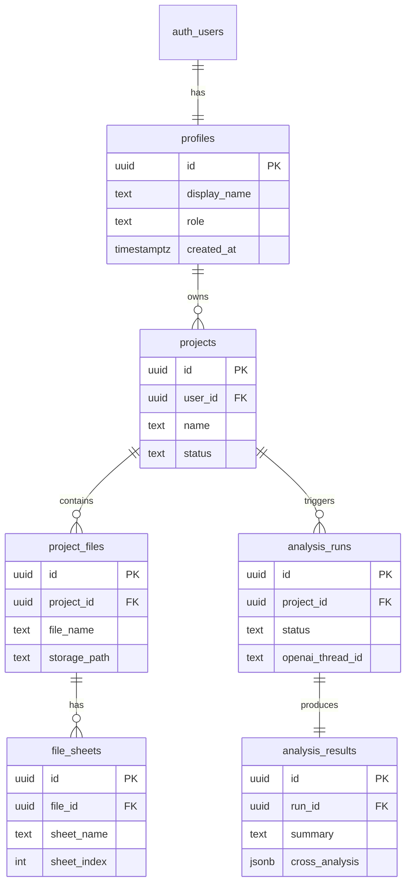

# 06. 데이터베이스 스키마 설계

> **이 문서를 읽으면 알 수 있는 것**
>
> - Supabase PostgreSQL에 만들 **테이블 구조**와 **컬럼 역할**
> - Users(프로필), Projects, Files, Sheets, Analysis Runs/Results 간 **관계(ERD)**
> - **RLS(행 수준 보안)**, **Storage 버킷**, **SQL DDL** 초안

---

## 목차

1. [설계 개요](#1-설계-개요)
2. [ERD (엔티티 관계도)](#2-erd-엔티티-관계도)
3. [테이블 관계 요약](#3-테이블-관계-요약)
4. [테이블 상세: profiles](#4-테이블-상세-profiles)
5. [테이블 상세: projects](#5-테이블-상세-projects)
6. [테이블 상세: project_files](#6-테이블-상세-project_files)
7. [테이블 상세: file_sheets](#7-테이블-상세-file_sheets)
8. [테이블 상세: analysis_runs](#8-테이블-상세-analysis_runs)
9. [테이블 상세: analysis_results](#9-테이블-상세-analysis_results)
10. [Supabase Storage 설계](#10-supabase-storage-설계)
11. [RLS (Row Level Security)](#11-rls-row-level-security)
12. [SQL DDL 전체 초안](#12-sql-ddl-전체-초안)
13. [구버전 스키마와의 매핑](#13-구버전-스키마와의-매핑)
14. [TypeScript 타입 연동 가이드](#14-typescript-타입-연동-가이드)
15. [Phase 3 적용 체크리스트](#15-phase-3-적용-체크리스트)

---

## 1. 설계 개요

### 1.1 설계 원칙

| 원칙 | 설명 |
|------|------|
| **Auth 필수** | 모든 프로젝트는 `auth.users`에 연결된 사용자 소유 |
| **프로젝트 중심** | 분석 단위 = `projects` (파일 N개 + 시트 M개) |
| **snake_case** | 테이블·컬럼명 ([04_coding_guideline.md](./04_coding_guideline.md) 준수) |
| **RLS** | `auth.uid()` = 소유자인 행만 접근 |
| **CASCADE** | 프로젝트 삭제 시 하위 파일·시트·분석 이력 함께 삭제 |

### 1.2 비개발자를 위한 비유

| DB 개념 | 비유 |
|---------|------|
| `profiles` | 직원 명찰 (로그인 계정 정보) |
| `projects` | 업무 폴더 |
| `project_files` | 폴더 안의 엑셀 파일 |
| `file_sheets` | 엑셀 하단의 **시트 탭** 목록·헤더 정보 |
| `analysis_runs` | "전체 분석 실행" 버튼을 누른 **한 번의 작업** |
| `analysis_results` | AI가 작성한 **종합 보고서** |

### 1.3 요구사항 문서와의 연결

본 스키마는 [05_system_requirements.md](./05_system_requirements.md)의 다음 요구를 데이터 모델로 구현합니다.

- FR-01 ~ FR-02: `profiles`, `projects`
- FR-03 ~ FR-04: `project_files`, `file_sheets`
- FR-05 ~ FR-06: `analysis_runs`, `analysis_results`
- FR-07: `analysis_runs` 다건 이력

---

## 2. ERD (엔티티 관계도)



### 관계 (카디널리티) 설명

```
auth.users (1) ──── (1) profiles
profiles     (1) ──── (N) projects
projects     (1) ──── (N) project_files
project_files(1) ──── (N) file_sheets
projects     (1) ──── (N) analysis_runs
analysis_runs(1) ──── (1) analysis_results
```

---

## 3. 테이블 관계 요약

| 부모 | 자식 | 관계 | ON DELETE |
|------|------|------|-----------|
| `auth.users` | `profiles` | 1:1 | CASCADE |
| `profiles` | `projects` | 1:N | CASCADE |
| `projects` | `project_files` | 1:N | CASCADE |
| `project_files` | `file_sheets` | 1:N | CASCADE |
| `projects` | `analysis_runs` | 1:N | CASCADE |
| `analysis_runs` | `analysis_results` | 1:1 | CASCADE |

> **프로젝트 1개 삭제** → 파일, 시트, 분석 run, 결과가 **연쇄 삭제**됩니다. Storage 객체는 API 또는 트리거/배치로 별도 정리합니다.

---

## 4. 테이블 상세: profiles

Supabase `auth.users`를 확장하는 **사용자 프로필** 테이블입니다.  
앱에서 "Users"로 부르는 정보는 **`profiles`** 에 저장합니다.

### 4.1 컬럼 정의

| 컬럼 | 타입 | NULL | 기본값 | 설명 | 예시 |
|------|------|------|--------|------|------|
| `id` | UUID | NO | - | PK, `auth.users.id`와 동일 | `a1b2c3...` |
| `display_name` | TEXT | YES | NULL | 화면 표시 이름 | `박PM` |
| `role` | TEXT | YES | NULL | (선택) 직무: designer, pm, sales | `pm` |
| `created_at` | TIMESTAMPTZ | NO | `NOW()` | 가입(프로필 생성) 시각 | |
| `updated_at` | TIMESTAMPTZ | NO | `NOW()` | 수정 시각 | |

### 4.2 제약 조건

- `role` CHECK: `role IN ('designer', 'pm', 'sales')` 또는 NULL
- `id` REFERENCES `auth.users(id)` ON DELETE CASCADE

### 4.3 프로필 자동 생성

회원가입 시 `auth.users` INSERT → 트리거로 `profiles` 행 자동 생성 (DDL 12절 참고).

---

## 5. 테이블 상세: projects

**프로젝트** = 여러 엑셀 파일을 묶는 **분석 작업 단위**.

### 5.1 컬럼 정의

| 컬럼 | 타입 | NULL | 기본값 | 설명 | 예시 |
|------|------|------|--------|------|------|
| `id` | UUID | NO | `gen_random_uuid()` | PK | |
| `user_id` | UUID | NO | - | FK → `profiles.id`, 소유자 | |
| `name` | TEXT | NO | - | 프로젝트명 | `OO공사 2025 견적 검토` |
| `description` | TEXT | YES | NULL | 설명·메모 | `토목+전기 내역 통합` |
| `status` | TEXT | NO | `'draft'` | 생명주기 상태 | `ready` |
| `created_at` | TIMESTAMPTZ | NO | `NOW()` | 생성 시각 | |
| `updated_at` | TIMESTAMPTZ | NO | `NOW()` | 수정 시각 | |

### 5.2 status 값

| 값 | 의미 |
|----|------|
| `draft` | 생성 직후, 파일 없음 |
| `ready` | 파일 1개 이상, 분석 가능 |
| `analyzing` | AI 분석 진행 중 |
| `completed` | 최근 분석 성공 |
| `failed` | 최근 분석 실패 |

CHECK: `status IN ('draft', 'ready', 'analyzing', 'completed', 'failed')`

### 5.3 인덱스

- `idx_projects_user_id` ON `(user_id)`
- `idx_projects_status` ON `(status)` (선택)

---

## 6. 테이블 상세: project_files

프로젝트에 업로드된 **엑셀/CSV 파일** 메타데이터.  
실제 바이너리는 **Supabase Storage**에 저장합니다.

### 6.1 컬럼 정의

| 컬럼 | 타입 | NULL | 기본값 | 설명 | 예시 |
|------|------|------|--------|------|------|
| `id` | UUID | NO | `gen_random_uuid()` | PK | |
| `project_id` | UUID | NO | - | FK → `projects.id` | |
| `file_name` | TEXT | NO | - | 원본 파일명 | `내역_A.xlsx` |
| `storage_path` | TEXT | NO | - | Storage 객체 경로 | `{project_id}/{file_id}/내역_A.xlsx` |
| `file_size` | BIGINT | YES | NULL | 바이트 크기 | `1048576` |
| `mime_type` | TEXT | YES | NULL | MIME | `application/vnd...sheet` |
| `sheet_count` | INT | YES | NULL | 시트 개수 (파싱 후) | `2` |
| `upload_order` | INT | NO | `0` | 업로드 순서 (UI 정렬) | `1` |
| `created_at` | TIMESTAMPTZ | NO | `NOW()` | 업로드 시각 | |

### 6.2 인덱스

- `idx_project_files_project_id` ON `(project_id)`

---

## 7. 테이블 상세: file_sheets

각 `project_files` 레코드에 속한 **시트(탭)** 정보.  
AI 프롬프트에 "어떤 시트에 어떤 컬럼이 있는지" 전달하는 데 사용합니다.

### 7.1 컬럼 정의

| 컬럼 | 타입 | NULL | 기본값 | 설명 | 예시 |
|------|------|------|--------|------|------|
| `id` | UUID | NO | `gen_random_uuid()` | PK | |
| `file_id` | UUID | NO | - | FK → `project_files.id` | |
| `sheet_name` | TEXT | NO | - | 시트 탭 이름 | `토목` |
| `sheet_index` | INT | NO | `0` | 0-based 순서 | `0` |
| `row_count` | INT | YES | NULL | 데이터 행 수 (헤더 제외) | `150` |
| `column_headers` | JSONB | YES | `'[]'` | 1행 헤더 배열 | `["메이커","모델","수량","단가"]` |
| `created_at` | TIMESTAMPTZ | NO | `NOW()` | | |

### 7.2 column_headers JSON 예시

```json
["공종", "항목", "메이커", "모델", "사양", "수량", "단위", "단가", "금액"]
```

CSV 파일은 `sheet_name = 'Sheet1'` 또는 파일명과 동일하게 1개 시트로 저장합니다.

### 7.3 인덱스

- `idx_file_sheets_file_id` ON `(file_id)`

---

## 8. 테이블 상세: analysis_runs

프로젝트 단위 **"전체 분석 실행"** 1회 = `analysis_runs` 1건.  
재분석 시 **새 run** 이 생성되어 이력이 쌓입니다 (FR-07).

### 8.1 컬럼 정의

| 컬럼 | 타입 | NULL | 기본값 | 설명 | 예시 |
|------|------|------|--------|------|------|
| `id` | UUID | NO | `gen_random_uuid()` | PK | |
| `project_id` | UUID | NO | - | FK → `projects.id` | |
| `status` | TEXT | NO | `'pending'` | 실행 상태 | `processing` |
| `openai_thread_id` | TEXT | YES | NULL | OpenAI Thread ID | `thread_abc` |
| `openai_run_id` | TEXT | YES | NULL | OpenAI Run ID | `run_xyz` |
| `error_message` | TEXT | YES | NULL | 실패 시 한국어 메시지 | `분석 시간 초과` |
| `started_at` | TIMESTAMPTZ | YES | NULL | 분석 시작 | |
| `completed_at` | TIMESTAMPTZ | YES | NULL | 분석 종료 | |
| `created_at` | TIMESTAMPTZ | NO | `NOW()` | 레코드 생성 | |

### 8.2 status 값

CHECK: `status IN ('pending', 'processing', 'completed', 'failed')`

### 8.3 인덱스

- `idx_analysis_runs_project_id` ON `(project_id)`
- `idx_analysis_runs_status` ON `(status)`

---

## 9. 테이블 상세: analysis_results

`analysis_runs` 1건당 **종합 리포트 1건** (1:1).

### 9.1 컬럼 정의

| 컬럼 | 타입 | NULL | 기본값 | 설명 | 예시 |
|------|------|------|--------|------|------|
| `id` | UUID | NO | `gen_random_uuid()` | PK | |
| `run_id` | UUID | NO | - | FK → `analysis_runs.id`, **UNIQUE** | |
| `summary` | TEXT | YES | NULL | Executive Summary | `본 프로젝트는...` |
| `cross_analysis` | JSONB | YES | `'{}'` | 교차 분석 구조화 데이터 | 아래 예시 |
| `insights` | JSONB | YES | `'[]'` | 인사이트 bullet 배열 | `["A사 단가 15% 높음"]` |
| `chart_urls` | TEXT[] | YES | `'{}'` | 차트 PNG URL 배열 | Storage signed URL |
| `metadata` | JSONB | YES | `'{}'` | 부가 정보 (컬럼 매핑 등) | |
| `raw_response` | TEXT | YES | NULL | (선택) AI 원문, 디버깅 | |
| `created_at` | TIMESTAMPTZ | NO | `NOW()` | | |

### 9.2 cross_analysis JSON 예시

```json
{
  "sections": [
    {
      "title": "메이커별 가격 비교",
      "type": "comparison_table",
      "rows": [
        { "maker": "A사", "total_amount": 15000000, "file_ref": "단가표.xlsx" },
        { "maker": "B사", "total_amount": 13200000, "file_ref": "단가표.xlsx" }
      ]
    },
    {
      "title": "모델 불일치",
      "type": "mismatch_list",
      "items": [
        { "model_a": "XX-100", "sheet_a": "토목", "model_b": "XX-100A", "sheet_b": "전기" }
      ]
    }
  ]
}
```

### 9.3 insights JSON 예시

```json
[
  "전체 장비 금액 합계 약 4.2억 원",
  "A사와 B사 동일 모델 단가 차이 12%",
  "공사내역서 B에만 존재하는 항목 3건"
]
```

---

## 10. Supabase Storage 설계

### 10.1 버킷 목록

| 버킷 ID | 공개 | 용도 |
|---------|------|------|
| `project-files` | Private | 업로드 원본 `.xlsx`, `.csv` |
| `analysis-assets` | Private | AI 생성 차트 PNG |

### 10.2 경로 규칙

```
project-files/
  {project_id}/
    {file_id}/
      {original_file_name}     ← 예: 내역_A.xlsx

analysis-assets/
  {run_id}/
    chart_1.png
    chart_2.png
```

### 10.3 DB와 Storage 연결

| DB 컬럼 | Storage |
|---------|---------|
| `project_files.storage_path` | `project-files` 버킷 내 전체 경로 |
| `analysis_results.chart_urls` | `analysis-assets` signed URL 또는 public path |

### 10.4 접근 정책 (개념)

- 클라이언트 **직접 업로드** 시: Storage RLS + `auth.uid()`가 프로젝트 소유자인지 검증
- **서버(Service Role)** 업로드: API Route에서 chart 저장
- 다운로드: **signed URL** (만료 1시간 등) — API Route에서 발급 권장

---

## 11. RLS (Row Level Security)

### 11.1 기본 규칙

> **로그인한 사용자(`auth.uid()`)는 자신이 소유한 `projects`와 그 하위 데이터만** SELECT / INSERT / UPDATE / DELETE 할 수 있다.

### 11.2 테이블별 정책 요약

| 테이블 | SELECT | INSERT | UPDATE | DELETE | 조건 |
|--------|--------|--------|--------|--------|------|
| `profiles` | 본인 | 트리거만 | 본인 | - | `id = auth.uid()` |
| `projects` | 본인 | 본인 user_id | 본인 | 본인 | `user_id = auth.uid()` |
| `project_files` | 프로젝트 소유 | 프로젝트 소유 | 프로젝트 소유 | 프로젝트 소유 | JOIN projects |
| `file_sheets` | 파일→프로젝트 소유 | 동일 | 동일 | 동일 | JOIN project_files |
| `analysis_runs` | 프로젝트 소유 | 프로젝트 소유 | 프로젝트 소유 | 프로젝트 소유 | JOIN projects |
| `analysis_results` | run→프로젝트 소유 | run→프로젝트 소유 | run→프로젝트 소유 | run→프로젝트 소유 | JOIN analysis_runs |

### 11.3 헬퍼 함수 (권장)

RLS 정책에서 반복 JOIN을 줄이기 위해:

```sql
-- 프로젝트 소유 여부 확인
CREATE OR REPLACE FUNCTION public.is_project_owner(p_project_id UUID)
RETURNS BOOLEAN AS $$
  SELECT EXISTS (
    SELECT 1 FROM public.projects
    WHERE id = p_project_id AND user_id = auth.uid()
  );
$$ LANGUAGE sql SECURITY DEFINER STABLE;
```

`project_files` INSERT 정책 예: `is_project_owner(project_id)`

---

## 12. SQL DDL 전체 초안

Supabase Dashboard → **SQL Editor**에 붙여 넣어 실행합니다.  
(주석은 초보자용 설명)

```sql
-- ============================================================
-- AI 엑셀 분석 서비스 — DB 스키마 v1.0
-- docs/06_database_schema.md 기준
-- ============================================================

-- ─── 1. profiles (Users 확장) ───────────────────────────────
CREATE TABLE public.profiles (
  id UUID PRIMARY KEY REFERENCES auth.users(id) ON DELETE CASCADE,
  display_name TEXT,
  role TEXT CHECK (role IS NULL OR role IN ('designer', 'pm', 'sales')),
  created_at TIMESTAMPTZ NOT NULL DEFAULT NOW(),
  updated_at TIMESTAMPTZ NOT NULL DEFAULT NOW()
);

COMMENT ON TABLE public.profiles IS 'Supabase Auth 사용자 프로필 (Users)';

-- 가입 시 profiles 자동 생성
CREATE OR REPLACE FUNCTION public.handle_new_user()
RETURNS TRIGGER AS $$
BEGIN
  INSERT INTO public.profiles (id, display_name)
  VALUES (
    NEW.id,
    COALESCE(NEW.raw_user_meta_data->>'display_name', NEW.email)
  );
  RETURN NEW;
END;
$$ LANGUAGE plpgsql SECURITY DEFINER;

CREATE TRIGGER on_auth_user_created
  AFTER INSERT ON auth.users
  FOR EACH ROW EXECUTE FUNCTION public.handle_new_user();

-- ─── 2. projects ─────────────────────────────────────────────
CREATE TABLE public.projects (
  id UUID PRIMARY KEY DEFAULT gen_random_uuid(),
  user_id UUID NOT NULL REFERENCES public.profiles(id) ON DELETE CASCADE,
  name TEXT NOT NULL,
  description TEXT,
  status TEXT NOT NULL DEFAULT 'draft'
    CHECK (status IN ('draft', 'ready', 'analyzing', 'completed', 'failed')),
  created_at TIMESTAMPTZ NOT NULL DEFAULT NOW(),
  updated_at TIMESTAMPTZ NOT NULL DEFAULT NOW()
);

CREATE INDEX idx_projects_user_id ON public.projects(user_id);

COMMENT ON TABLE public.projects IS '분석 작업 단위 — 여러 파일을 묶는 프로젝트';

-- ─── 3. project_files ────────────────────────────────────────
CREATE TABLE public.project_files (
  id UUID PRIMARY KEY DEFAULT gen_random_uuid(),
  project_id UUID NOT NULL REFERENCES public.projects(id) ON DELETE CASCADE,
  file_name TEXT NOT NULL,
  storage_path TEXT NOT NULL,
  file_size BIGINT,
  mime_type TEXT,
  sheet_count INT,
  upload_order INT NOT NULL DEFAULT 0,
  created_at TIMESTAMPTZ NOT NULL DEFAULT NOW()
);

CREATE INDEX idx_project_files_project_id ON public.project_files(project_id);

COMMENT ON TABLE public.project_files IS '프로젝트에 업로드된 엑셀/CSV 파일 메타';

-- ─── 4. file_sheets ──────────────────────────────────────────
CREATE TABLE public.file_sheets (
  id UUID PRIMARY KEY DEFAULT gen_random_uuid(),
  file_id UUID NOT NULL REFERENCES public.project_files(id) ON DELETE CASCADE,
  sheet_name TEXT NOT NULL,
  sheet_index INT NOT NULL DEFAULT 0,
  row_count INT,
  column_headers JSONB DEFAULT '[]'::jsonb,
  created_at TIMESTAMPTZ NOT NULL DEFAULT NOW()
);

CREATE INDEX idx_file_sheets_file_id ON public.file_sheets(file_id);

COMMENT ON TABLE public.file_sheets IS '엑셀 파일 내 시트(탭) 메타 — AI 컨텍스트용';

-- ─── 5. analysis_runs ────────────────────────────────────────
CREATE TABLE public.analysis_runs (
  id UUID PRIMARY KEY DEFAULT gen_random_uuid(),
  project_id UUID NOT NULL REFERENCES public.projects(id) ON DELETE CASCADE,
  status TEXT NOT NULL DEFAULT 'pending'
    CHECK (status IN ('pending', 'processing', 'completed', 'failed')),
  openai_thread_id TEXT,
  openai_run_id TEXT,
  error_message TEXT,
  started_at TIMESTAMPTZ,
  completed_at TIMESTAMPTZ,
  created_at TIMESTAMPTZ NOT NULL DEFAULT NOW()
);

CREATE INDEX idx_analysis_runs_project_id ON public.analysis_runs(project_id);
CREATE INDEX idx_analysis_runs_status ON public.analysis_runs(status);

COMMENT ON TABLE public.analysis_runs IS '프로젝트 단위 AI 분석 실행 1회 = 1 run';

-- ─── 6. analysis_results ─────────────────────────────────────
CREATE TABLE public.analysis_results (
  id UUID PRIMARY KEY DEFAULT gen_random_uuid(),
  run_id UUID NOT NULL UNIQUE REFERENCES public.analysis_runs(id) ON DELETE CASCADE,
  summary TEXT,
  cross_analysis JSONB DEFAULT '{}'::jsonb,
  insights JSONB DEFAULT '[]'::jsonb,
  chart_urls TEXT[] DEFAULT '{}',
  metadata JSONB DEFAULT '{}'::jsonb,
  raw_response TEXT,
  created_at TIMESTAMPTZ NOT NULL DEFAULT NOW()
);

COMMENT ON TABLE public.analysis_results IS 'analysis_runs 1건당 종합 AI 리포트';

-- ─── 7. updated_at 자동 갱신 (projects, profiles) ──────────
CREATE OR REPLACE FUNCTION public.set_updated_at()
RETURNS TRIGGER AS $$
BEGIN
  NEW.updated_at = NOW();
  RETURN NEW;
END;
$$ LANGUAGE plpgsql;

CREATE TRIGGER profiles_updated_at
  BEFORE UPDATE ON public.profiles
  FOR EACH ROW EXECUTE FUNCTION public.set_updated_at();

CREATE TRIGGER projects_updated_at
  BEFORE UPDATE ON public.projects
  FOR EACH ROW EXECUTE FUNCTION public.set_updated_at();

-- ─── 8. RLS 활성화 ───────────────────────────────────────────
ALTER TABLE public.profiles ENABLE ROW LEVEL SECURITY;
ALTER TABLE public.projects ENABLE ROW LEVEL SECURITY;
ALTER TABLE public.project_files ENABLE ROW LEVEL SECURITY;
ALTER TABLE public.file_sheets ENABLE ROW LEVEL SECURITY;
ALTER TABLE public.analysis_runs ENABLE ROW LEVEL SECURITY;
ALTER TABLE public.analysis_results ENABLE ROW LEVEL SECURITY;

-- ─── 9. RLS 정책: profiles ───────────────────────────────────
CREATE POLICY "profiles_select_own"
  ON public.profiles FOR SELECT
  USING (id = auth.uid());

CREATE POLICY "profiles_update_own"
  ON public.profiles FOR UPDATE
  USING (id = auth.uid());

-- ─── 10. RLS 정책: projects ──────────────────────────────────
CREATE POLICY "projects_all_own"
  ON public.projects FOR ALL
  USING (user_id = auth.uid())
  WITH CHECK (user_id = auth.uid());

-- ─── 11. RLS 정책: project_files ─────────────────────────────
CREATE POLICY "project_files_all_via_project"
  ON public.project_files FOR ALL
  USING (
    EXISTS (
      SELECT 1 FROM public.projects p
      WHERE p.id = project_files.project_id AND p.user_id = auth.uid()
    )
  )
  WITH CHECK (
    EXISTS (
      SELECT 1 FROM public.projects p
      WHERE p.id = project_files.project_id AND p.user_id = auth.uid()
    )
  );

-- ─── 12. RLS 정책: file_sheets ───────────────────────────────
CREATE POLICY "file_sheets_all_via_file"
  ON public.file_sheets FOR ALL
  USING (
    EXISTS (
      SELECT 1 FROM public.project_files pf
      JOIN public.projects p ON p.id = pf.project_id
      WHERE pf.id = file_sheets.file_id AND p.user_id = auth.uid()
    )
  )
  WITH CHECK (
    EXISTS (
      SELECT 1 FROM public.project_files pf
      JOIN public.projects p ON p.id = pf.project_id
      WHERE pf.id = file_sheets.file_id AND p.user_id = auth.uid()
    )
  );

-- ─── 13. RLS 정책: analysis_runs ─────────────────────────────
CREATE POLICY "analysis_runs_all_via_project"
  ON public.analysis_runs FOR ALL
  USING (
    EXISTS (
      SELECT 1 FROM public.projects p
      WHERE p.id = analysis_runs.project_id AND p.user_id = auth.uid()
    )
  )
  WITH CHECK (
    EXISTS (
      SELECT 1 FROM public.projects p
      WHERE p.id = analysis_runs.project_id AND p.user_id = auth.uid()
    )
  );

-- ─── 14. RLS 정책: analysis_results ──────────────────────────
CREATE POLICY "analysis_results_all_via_run"
  ON public.analysis_results FOR ALL
  USING (
    EXISTS (
      SELECT 1 FROM public.analysis_runs ar
      JOIN public.projects p ON p.id = ar.project_id
      WHERE ar.id = analysis_results.run_id AND p.user_id = auth.uid()
    )
  )
  WITH CHECK (
    EXISTS (
      SELECT 1 FROM public.analysis_runs ar
      JOIN public.projects p ON p.id = ar.project_id
      WHERE ar.id = analysis_results.run_id AND p.user_id = auth.uid()
    )
  );
```

### Storage 버킷 (Dashboard에서 생성)

1. **Storage → New bucket** → `project-files` (Private)
2. **Storage → New bucket** → `analysis-assets` (Private)
3. Storage RLS 정책은 Phase 3 구현 시 `projects.user_id = auth.uid()` 기준으로 추가

---

## 13. 구버전 스키마와의 매핑

[03_development_plan.md](./03_development_plan.md) Phase 3의 **`analysis_sessions`** 모델은 **deprecated** 입니다.

| 구버전 | 신규 | 비고 |
|--------|------|------|
| (없음) | `profiles` | Auth 필수로 추가 |
| (암묵적 세션) | `projects` | 프로젝트 단위 |
| `analysis_sessions.file_name` | `project_files.file_name` | 파일 N개 |
| (없음) | `file_sheets` | 다중 Sheet |
| `analysis_sessions.status` | `projects.status` + `analysis_runs.status` | 이중 상태 |
| `analysis_sessions` 1건 | `analysis_runs` 1건 | 분석 실행 |
| `analysis_results.session_id` | `analysis_results.run_id` | FK 변경 |

---

## 14. TypeScript 타입 연동 가이드

Phase 3 이후 [types/analysis.ts](../types/analysis.ts) 를 아래 구조로 **갱신**합니다. (본 문서 작성 시점에는 코드 미변경)

```typescript
// types/project.ts (신규 파일 권장)

export type ProjectStatus =
  | "draft" | "ready" | "analyzing" | "completed" | "failed";

export interface Project {
  id: string;
  userId: string;
  name: string;
  description: string | null;
  status: ProjectStatus;
  createdAt: string;
  updatedAt: string;
}

export interface ProjectFile {
  id: string;
  projectId: string;
  fileName: string;
  storagePath: string;
  fileSize: number | null;
  mimeType: string | null;
  sheetCount: number | null;
  uploadOrder: number;
  createdAt: string;
}

export interface FileSheet {
  id: string;
  fileId: string;
  sheetName: string;
  sheetIndex: number;
  rowCount: number | null;
  columnHeaders: string[];
  createdAt: string;
}

export interface AnalysisRun {
  id: string;
  projectId: string;
  status: "pending" | "processing" | "completed" | "failed";
  errorMessage: string | null;
  startedAt: string | null;
  completedAt: string | null;
  createdAt: string;
}

export interface AnalysisResult {
  id: string;
  runId: string;
  summary: string | null;
  crossAnalysis: Record<string, unknown>;
  insights: string[];
  chartUrls: string[];
  metadata: Record<string, unknown>;
  createdAt: string;
}
```

> DB `snake_case` ↔ TS `camelCase` 변환은 API Route 또는 Supabase 클라이언트 레이어에서 수행합니다.

---

## 15. Phase 3 적용 체크리스트

[03_development_plan.md](./03_development_plan.md) Phase 3 수행 시 본 문서 기준으로 확인합니다.

- [ ] SQL Editor에서 12절 DDL 실행
- [ ] Storage 버킷 `project-files`, `analysis-assets` 생성
- [ ] Auth 회원가입 테스트 → `profiles` 자동 생성 확인
- [ ] RLS: 다른 사용자 UUID로 SELECT 차단 확인
- [ ] `types/project.ts` (또는 analysis.ts) 갱신
- [ ] 업로드 API → `project_files` + `file_sheets` INSERT
- [ ] analyze API → `analysis_runs` + `analysis_results` INSERT

---

## 관련 문서

- [05_system_requirements.md](./05_system_requirements.md) — 기능·시나리오
- [01_system_architecture.md](./01_system_architecture.md) — 시스템 구성
- [04_coding_guideline.md](./04_coding_guideline.md) — snake_case, API 규칙
