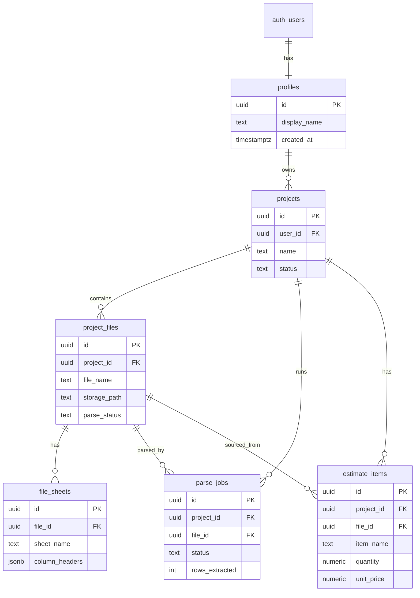

# 06. 데이터베이스 스키마 설계 (v2 — 구조화 데이터 자산화)

> **이 문서를 읽으면 알 수 있는 것**
>
> - Supabase PostgreSQL에 만들 **테이블 구조**와 **컬럼 역할**
> - 엑셀 1행이 DB 1행(`estimate_items`)으로 저장되는 **핵심 설계**
> - **RLS(행 수준 보안)**, **Storage 버킷**, **마이그레이션 SQL** 위치

---

## 목차

1. [설계 개요](#1-설계-개요)
2. [ERD (엔티티 관계도)](#2-erd-엔티티-관계도)
3. [테이블 관계 요약](#3-테이블-관계-요약)
4. [테이블 상세: profiles](#4-테이블-상세-profiles)
5. [테이블 상세: projects](#5-테이블-상세-projects)
6. [테이블 상세: project_files](#6-테이블-상세-project_files)
7. [테이블 상세: file_sheets](#7-테이블-상세-file_sheets)
8. [테이블 상세: parse_jobs](#8-테이블-상세-parse_jobs)
9. [테이블 상세: estimate_items](#9-테이블-상세-estimate_items)
10. [Supabase Storage 설계](#10-supabase-storage-설계)
11. [RLS (Row Level Security)](#11-rls-row-level-security)
12. [마이그레이션 SQL](#12-마이그레이션-sql)
13. [구 아키텍처와의 매핑](#13-구-아키텍처와의-매핑)
14. [TypeScript 타입 연동 가이드](#14-typescript-타입-연동-가이드)
15. [적용 체크리스트](#15-적용-체크리스트)

---

## 1. 설계 개요

### 1.1 아키텍처 변경 배경

| 구 방식 (폐기) | 신 방식 (본 문서) |
|----------------|-------------------|
| AI 채팅 + Code Interpreter | AI **Structured Output** (JSON) |
| `analysis_results`에 텍스트 리포트 | **`estimate_items`에 행 단위 데이터** |
| 차트·요약 중심 | **편집 가능한 표 + 엑셀 Export** |

### 1.2 설계 원칙

| 원칙 | 설명 |
|------|------|
| **Auth 필수** | 모든 프로젝트는 `auth.users`에 연결된 사용자 소유 |
| **프로젝트 중심** | 분석 단위 = `projects` (파일 N개 → 파싱 → 항목 M행) |
| **행 단위 자산화** | 엑셀 각 데이터 행 = `estimate_items` 1레코드 |
| **snake_case** | 테이블·컬럼명 ([04_coding_guideline.md](./04_coding_guideline.md) 준수) |
| **RLS** | `auth.uid()` = 소유자인 행만 접근 |
| **CASCADE** | 프로젝트 삭제 시 하위 파일·시트·파싱·항목 함께 삭제 |

### 1.3 비개발자를 위한 비유

| DB 개념 | 비유 |
|---------|------|
| `profiles` | 직원 명찰 (로그인 계정) |
| `projects` | 업무 폴더 (한 건의 견적·내역 검토) |
| `project_files` | 폴더 안의 **원본 엑셀 파일** |
| `file_sheets` | 엑셀 하단 **시트 탭** 정보 (이름·헤더) |
| `parse_jobs` | AI가 엑셀을 읽어들이는 **작업 지시서** (1회 실행) |
| `estimate_items` | AI가 추출한 **항목 장부** (품명·수량·단가… 1행=1줄) |

### 1.4 요구사항 문서와의 연결

본 스키마는 [05_system_requirements.md](./05_system_requirements.md)의 다음 요구를 구현합니다.

- FR-01 ~ FR-02: `profiles`, `projects`
- FR-03: `project_files`, `file_sheets`
- FR-04: `parse_jobs`, `estimate_items`
- FR-05 ~ FR-06: `estimate_items` (CRUD)
- FR-07: `estimate_items` → Export (DB 조회)
- FR-08: `parse_jobs` 이력

---

## 2. ERD (엔티티 관계도)



---

## 3. 테이블 관계 요약

```
profiles     (1) ──── (N) projects
projects     (1) ──── (N) project_files
project_files(1) ──── (N) file_sheets
projects     (1) ──── (N) parse_jobs
project_files(1) ──── (N) parse_jobs
projects     (1) ──── (N) estimate_items
project_files(1) ──── (N) estimate_items
```

| 부모 | 자식 | 관계 | ON DELETE |
|------|------|------|-----------|
| `profiles` | `projects` | 1:N | CASCADE |
| `projects` | `project_files` | 1:N | CASCADE |
| `project_files` | `file_sheets` | 1:N | CASCADE |
| `projects` | `parse_jobs` | 1:N | CASCADE |
| `project_files` | `parse_jobs` | 1:N | CASCADE |
| `projects` | `estimate_items` | 1:N | CASCADE |
| `project_files` | `estimate_items` | 1:N | CASCADE |

---

## 4. 테이블 상세: profiles

Supabase Auth(`auth.users`)를 확장하는 **사용자 프로필** 테이블.

| 컬럼 | 타입 | NULL | 기본값 | 설명 |
|------|------|------|--------|------|
| `id` | UUID | NO | - | PK, FK → `auth.users.id` |
| `display_name` | TEXT | YES | NULL | 화면 표시 이름 |
| `role` | TEXT | YES | NULL | `designer` / `pm` / `sales` (선택) |
| `created_at` | TIMESTAMPTZ | NO | `NOW()` | 생성 시각 |
| `updated_at` | TIMESTAMPTZ | NO | `NOW()` | 수정 시각 |

회원가입 시 트리거로 자동 생성됩니다 (마이그레이션 SQL 참고).

---

## 5. 테이블 상세: projects

**프로젝트** = 하나의 견적·내역 검토 작업 단위.

### 5.1 컬럼 정의

| 컬럼 | 타입 | NULL | 기본값 | 설명 | 예시 |
|------|------|------|--------|------|------|
| `id` | UUID | NO | `gen_random_uuid()` | PK | |
| `user_id` | UUID | NO | - | FK → `profiles.id` | |
| `name` | TEXT | NO | - | 프로젝트명 | `OO공사 견적 검토` |
| `description` | TEXT | YES | NULL | 설명·메모 | |
| `status` | TEXT | NO | `'draft'` | 생명주기 상태 | `parsed` |
| `created_at` | TIMESTAMPTZ | NO | `NOW()` | | |
| `updated_at` | TIMESTAMPTZ | NO | `NOW()` | | |

### 5.2 status 값

| 값 | 의미 |
|----|------|
| `draft` | 생성 직후, 파일 없음 |
| `ready` | 파일 1개 이상, 파싱 가능 |
| `parsing` | AI 파싱 진행 중 |
| `parsed` | 파싱 완료, `estimate_items` 존재 |
| `failed` | 최근 파싱 실패 |

CHECK: `status IN ('draft', 'ready', 'parsing', 'parsed', 'failed')`

> **구 버전과의 차이:** `analyzing` / `completed` / `openai_thread_id` 컬럼은 **삭제**되었습니다.

### 5.3 인덱스

- `idx_projects_user_id` ON `(user_id)`
- `idx_projects_status` ON `(status)`

---

## 6. 테이블 상세: project_files

프로젝트에 업로드된 **원본 엑셀/CSV** 메타데이터. 바이너리는 Storage에 저장.

| 컬럼 | 타입 | NULL | 기본값 | 설명 | 예시 |
|------|------|------|--------|------|------|
| `id` | UUID | NO | `gen_random_uuid()` | PK | |
| `project_id` | UUID | NO | - | FK → `projects.id` | |
| `file_name` | TEXT | NO | - | 원본 파일명 | `(제출)_POSCO_내역.xlsx` |
| `storage_path` | TEXT | NO | - | Storage 경로 | `{project_id}/{file_id}/file.xlsx` |
| `file_size` | BIGINT | YES | NULL | 바이트 크기 | |
| `mime_type` | TEXT | YES | NULL | MIME | |
| `sheet_count` | INT | YES | NULL | 시트 개수 | `3` |
| `parse_status` | TEXT | NO | `'pending'` | 파일별 파싱 상태 | `parsed` |
| `upload_order` | INT | NO | `0` | UI 정렬 | |
| `created_at` | TIMESTAMPTZ | NO | `NOW()` | | |

### parse_status 값

| 값 | 의미 |
|----|------|
| `pending` | 업로드만 됨, 파싱 전 |
| `parsing` | 파싱 중 |
| `parsed` | `estimate_items` 추출 완료 |
| `failed` | 파싱 실패 |

> **구 버전과의 차이:** `openai_file_id` 컬럼은 **삭제**되었습니다 (Assistants API 폐기).

---

## 7. 테이블 상세: file_sheets

각 파일의 **시트(탭)** 메타. AI 파싱 시 컨텍스트로 사용.

| 컬럼 | 타입 | NULL | 설명 |
|------|------|------|------|
| `id` | UUID | NO | PK |
| `file_id` | UUID | NO | FK → `project_files.id` |
| `sheet_name` | TEXT | NO | 시트 이름 |
| `sheet_index` | INT | NO | 0부터 순서 |
| `row_count` | INT | YES | 데이터 행 수 (헤더 제외) |
| `column_headers` | JSONB | YES | 헤더 배열 |
| `created_at` | TIMESTAMPTZ | NO | |

### column_headers JSON 예시

```json
["공종", "품명", "규격", "제조사", "수량", "단위", "단가", "합계"]
```

---

## 8. 테이블 상세: parse_jobs

**AI 파싱 실행 1회 = 1건.** 파일 단위로 파싱 이력을 남깁니다.

| 컬럼 | 타입 | NULL | 기본값 | 설명 | 예시 |
|------|------|------|--------|------|------|
| `id` | UUID | NO | `gen_random_uuid()` | PK | |
| `project_id` | UUID | NO | - | FK → `projects.id` | |
| `file_id` | UUID | NO | - | FK → `project_files.id` | |
| `status` | TEXT | NO | `'pending'` | 실행 상태 | `completed` |
| `model` | TEXT | YES | NULL | 사용 OpenAI 모델 | `gpt-4o` |
| `rows_extracted` | INT | YES | NULL | 추출된 행 수 | `128` |
| `error_message` | TEXT | YES | NULL | 실패 시 한국어 메시지 | |
| `started_at` | TIMESTAMPTZ | YES | NULL | 시작 | |
| `completed_at` | TIMESTAMPTZ | YES | NULL | 종료 | |
| `created_at` | TIMESTAMPTZ | NO | `NOW()` | | |

### status 값

CHECK: `status IN ('pending', 'processing', 'completed', 'failed')`

### 인덱스

- `idx_parse_jobs_project_id` ON `(project_id)`
- `idx_parse_jobs_file_id` ON `(file_id)`

> **구 버전 대체:** `analysis_runs` 테이블을 대체합니다.

---

## 9. 테이블 상세: estimate_items

**핵심 테이블.** AI가 엑셀에서 추출한 **각 데이터 행**을 저장합니다.  
웹 UI 테이블·엑셀 Export의 **단일 진실 공급원(Single Source of Truth)** 입니다.

| 컬럼 | 타입 | NULL | 기본값 | 설명 | 예시 |
|------|------|------|--------|------|------|
| `id` | UUID | NO | `gen_random_uuid()` | PK | |
| `project_id` | UUID | NO | - | FK → `projects.id` | |
| `file_id` | UUID | NO | - | FK → `project_files.id` | |
| `sheet_name` | TEXT | NO | - | 출처 시트 | `공사내역` |
| `source_row_index` | INT | YES | NULL | 원본 엑셀 행 번호 | `15` |
| `room_name` | TEXT | YES | NULL | 회의실명 | `301호` |
| `category` | TEXT | YES | NULL | 구분 | `전기` |
| `item_name` | TEXT | YES | NULL | 품명 | `LED 디스플레이` |
| `supplied_product` | TEXT | YES | NULL | 공급 제품 | `55inch 4K 패널` |
| `specification` | TEXT | YES | NULL | 규격 (레거시) | `55inch 4K` |
| `manufacturer` | TEXT | YES | NULL | 제조사 | `A사` |
| `quantity` | NUMERIC | YES | NULL | 수량 | `2` |
| `unit` | TEXT | YES | NULL | 단위 | `EA` |
| `material_cost_unit` | NUMERIC | YES | NULL | 자재비 단가 | `500000` |
| `material_cost_total` | NUMERIC | YES | NULL | 자재비 합계 | `1000000` |
| `ingredient_cost_unit` | NUMERIC | YES | NULL | 재료비 단가 | `100000` |
| `ingredient_cost_total` | NUMERIC | YES | NULL | 재료비 합계 | `200000` |
| `labor_cost_unit` | NUMERIC | YES | NULL | 노무비 단가 | `50000` |
| `labor_cost_total` | NUMERIC | YES | NULL | 노무비 합계 | `100000` |
| `unit_price` | NUMERIC | YES | NULL | 단가 (레거시) | `1500000` |
| `total_amount` | NUMERIC | YES | NULL | 합계 (레거시) | `3000000` |
| `remark` | TEXT | YES | NULL | 비고 | |
| `extra_fields` | JSONB | NO | `'{}'` | 매핑 안 된 추가 컬럼 | `{"비고2":"..."}` |
| `is_manually_edited` | BOOLEAN | NO | `false` | 사용자 수동 수정 여부 | |
| `sort_order` | INT | NO | `0` | UI·Export 정렬 | |
| `created_at` | TIMESTAMPTZ | NO | `NOW()` | | |
| `updated_at` | TIMESTAMPTZ | NO | `NOW()` | | |

### extra_fields JSON 예시

```json
{
  "원본_열_9": "설치비 포함",
  "매칭_키": "LED-55-4K"
}
```

### 인덱스

- `idx_estimate_items_project_id` ON `(project_id)`
- `idx_estimate_items_file_id` ON `(file_id)`
- `idx_estimate_items_item_name` ON `(item_name)` (검색·필터용)
- `idx_estimate_items_room_name` ON `(room_name)` (회의실 검색용)

> 회의실 견적 전용 컬럼 추가 SQL: [09_meeting_room_columns_migration.sql](./09_meeting_room_columns_migration.sql)

> **구 버전 대체:** `analysis_results` (텍스트 리포트)를 대체합니다.

---

## 10. Supabase Storage 설계

### 10.1 버킷 목록

| 버킷 ID | 공개 | 용도 |
|---------|------|------|
| `project-files` | Private | 업로드 원본 `.xlsx`, `.csv` |

> **구 버전:** `analysis-assets` (AI 차트 PNG) 버킷은 **더 이상 사용하지 않습니다.** Export는 API에서 즉시 생성·다운로드합니다.

### 10.2 경로 규칙

```
project-files/
  {project_id}/
    {file_id}/
      file.xlsx    ← ASCII 안전 경로 (원본명은 DB file_name에 저장)
```

### 10.3 접근 정책

- 업로드: API Route (Service Role) + 프로젝트 소유권 검증
- 다운로드: 파싱 API에서 Service Role로 읽기

---

## 11. RLS (Row Level Security)

### 11.1 기본 규칙

> **로그인한 사용자(`auth.uid()`)는 자신이 소유한 `projects`와 그 하위 데이터만** 접근할 수 있습니다.

### 11.2 테이블별 정책 요약

| 테이블 | SELECT | INSERT | UPDATE | DELETE | 조건 |
|--------|--------|--------|--------|--------|------|
| `profiles` | 본인 | 트리거만 | 본인 | - | `id = auth.uid()` |
| `projects` | 본인 | 본인 | 본인 | 본인 | `user_id = auth.uid()` |
| `project_files` | 프로젝트 소유 | 프로젝트 소유 | 프로젝트 소유 | 프로젝트 소유 | JOIN projects |
| `file_sheets` | 파일→프로젝트 소유 | 동일 | 동일 | 동일 | JOIN project_files |
| `parse_jobs` | 프로젝트 소유 | 프로젝트 소유 | 프로젝트 소유 | 프로젝트 소유 | JOIN projects |
| `estimate_items` | 프로젝트 소유 | 프로젝트 소유 | 프로젝트 소유 | 프로젝트 소유 | JOIN projects |

### 11.3 헬퍼 함수

```sql
CREATE OR REPLACE FUNCTION public.is_project_owner(p_project_id UUID)
RETURNS BOOLEAN AS $$
  SELECT EXISTS (
    SELECT 1 FROM public.projects
    WHERE id = p_project_id AND user_id = auth.uid()
  );
$$ LANGUAGE sql SECURITY DEFINER STABLE;
```

---

## 12. 마이그레이션 SQL

**신규 스키마 적용은 별도 파일에서 실행합니다:**

👉 **[08_new_schema_migration.sql](./08_new_schema_migration.sql)**

Supabase Dashboard → **SQL Editor** → 파일 내용 전체 복사·실행.

> **주의:** `analysis_runs`, `analysis_results` 테이블과 그 데이터는 **삭제**됩니다.  
> `profiles`, `projects`, `project_files`, `file_sheets` 기존 데이터는 **유지**됩니다.

---

## 13. 구 아키텍처와의 매핑

| 구 테이블/컬럼 | 신 테이블/컬럼 | 비고 |
|----------------|----------------|------|
| `analysis_runs` | `parse_jobs` | AI 실행 이력 |
| `analysis_results.summary` | `estimate_items` (N행) | 텍스트 → 구조화 행 |
| `projects.openai_thread_id` | (삭제) | 채팅 Thread 폐기 |
| `project_files.openai_file_id` | (삭제) | OpenAI Files API 폐기 |
| `projects.status = analyzing` | `projects.status = parsing` | 명칭 변경 |
| `projects.status = completed` | `projects.status = parsed` | 명칭 변경 |

---

## 14. TypeScript 타입 연동 가이드

```typescript
// types/project.ts

export type ProjectStatus =
  | "draft" | "ready" | "parsing" | "parsed" | "failed";

export type ParseStatus = "pending" | "parsing" | "parsed" | "failed";

export type ParseJobStatus =
  | "pending" | "processing" | "completed" | "failed";

export interface EstimateItem {
  id: string;
  projectId: string;
  fileId: string;
  sheetName: string;
  sourceRowIndex: number | null;
  category: string | null;
  itemName: string | null;
  specification: string | null;
  manufacturer: string | null;
  quantity: number | null;
  unit: string | null;
  unitPrice: number | null;
  totalAmount: number | null;
  remark: string | null;
  extraFields: Record<string, unknown>;
  isManuallyEdited: boolean;
  sortOrder: number;
  createdAt: string;
  updatedAt: string;
}

export interface ParseJob {
  id: string;
  projectId: string;
  fileId: string;
  status: ParseJobStatus;
  model: string | null;
  rowsExtracted: number | null;
  errorMessage: string | null;
  startedAt: string | null;
  completedAt: string | null;
  createdAt: string;
}
```

> DB `snake_case` ↔ TS `camelCase` 변환은 [`lib/supabase/map-row.ts`](../lib/supabase/map-row.ts)에서 수행합니다.

---

## 15. 적용 체크리스트

- [ ] [08_new_schema_migration.sql](./08_new_schema_migration.sql) SQL Editor 실행
- [ ] Storage 버킷 `project-files` 존재 확인
- [ ] Auth 회원가입 → `profiles` 자동 생성 확인
- [ ] RLS: 타 사용자 데이터 SELECT 차단 확인
- [ ] 업로드 → `project_files.parse_status = pending` 확인
- [ ] 파싱 API → `parse_jobs` + `estimate_items` INSERT 확인
- [ ] 테이블 UI → `estimate_items` CRUD 확인
- [ ] Export API → `estimate_items` 기반 .xlsx 다운로드 확인

---

## 관련 문서

- [05_system_requirements.md](./05_system_requirements.md) — 기능·시나리오
- [01_system_architecture.md](./01_system_architecture.md) — 시스템 구성·데이터 흐름
- [03_development_plan.md](./03_development_plan.md) — Phase 4~8 로드맵
- [08_new_schema_migration.sql](./08_new_schema_migration.sql) — 마이그레이션 SQL
