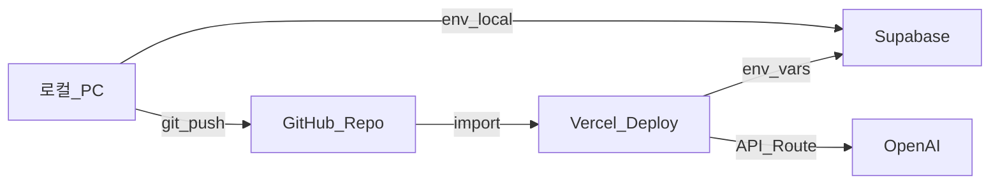

# 07. 환경 설정 및 외부 서비스 연동 가이드

> **이 문서를 읽으면 알 수 있는 것**
>
> - 로컬 PC에서 프로젝트를 **실행**하는 방법
> - **GitHub**에 코드를 올리는 방법
> - **Supabase** 프로젝트 생성 및 API 키를 `.env.local`에 넣는 방법
> - **Vercel**에 배포하고 환경 변수를 설정하는 방법

---

## 목차

1. [전체 흐름 한눈에 보기](#1-전체-흐름-한눈에-보기)
2. [사전 준비](#2-사전-준비)
3. [Step 1: 로컬에서 프로젝트 실행](#step-1-로컬에서-프로젝트-실행)
4. [Step 2: GitHub에 코드 올리기](#step-2-github에-코드-올리기)
5. [Step 3: Supabase 프로젝트 생성 및 키 설정](#step-3-supabase-프로젝트-생성-및-키-설정)
6. [Step 4: OpenAI API 키 설정](#step-4-openai-api-키-설정)
7. [Step 5: Vercel에 배포하기](#step-5-vercel에-배포하기)
8. [Step 6: 환경 변수 변경 후 재배포](#step-6-환경-변수-변경-후-재배포)
9. [완료 체크리스트](#9-완료-체크리스트)
10. [자주 하는 실수 (Troubleshooting)](#10-자주-하는-실수-troubleshooting)
11. [Supabase 코드 파일 위치](#11-supabase-코드-파일-위치)
12. [관련 문서](#12-관련-문서)

---

## 1. 전체 흐름 한눈에 보기



| 순서 | 어디서 | 무엇을 |
|------|--------|--------|
| 1 | 로컬 PC | 코드 실행·테스트 |
| 2 | GitHub | 코드 저장·버전 관리 |
| 3 | Supabase | DB·Storage·로그인 |
| 4 | OpenAI | AI 분석 API |
| 5 | Vercel | 인터넷에 웹사이트 공개 |

> **권장 순서:** Step 1 → Step 2 → Step 3 → Step 4 → Step 5

---

## 2. 사전 준비

### 2.1 설치·계정

| 항목 | 설명 | 링크 |
|------|------|------|
| **Node.js 20 LTS** | 로컬 실행에 필요 | [nodejs.org](https://nodejs.org/) |
| **Git** | GitHub 업로드에 필요 (Windows에 기본 포함되는 경우 많음) | [git-scm.com](https://git-scm.com/) |
| **GitHub 계정** | 코드 저장소 | [github.com](https://github.com/) |
| **Supabase 계정** | DB·Storage·Auth | [supabase.com](https://supabase.com/) |
| **Vercel 계정** | 배포 (GitHub로 가입 가능) | [vercel.com](https://vercel.com/) |
| **OpenAI 계정** | AI 분석 API | [platform.openai.com](https://platform.openai.com/) |

### 2.2 프로젝트 폴더

이 가이드는 아래 경로에 프로젝트가 있다고 가정합니다.

```
c:\MyProjects\Excel-Analysis
```

---

## Step 1: 로컬에서 프로젝트 실행

### 1-1. 터미널 열기

1. **Cursor** 또는 **VS Code**에서 프로젝트 폴더를 엽니다.
2. 메뉴 **터미널 → 새 터미널** (또는 `` Ctrl+` ``)

### 1-2. 패키지 설치

PowerShell에 아래를 입력하고 Enter:

```powershell
cd c:\MyProjects\Excel-Analysis
npm install
```

> `added XXX packages` 또는 `up to date`가 나오면 성공입니다.

### 1-3. 환경 변수 파일 만들기

```powershell
copy .env.example .env.local
```

- `.env.local` 파일이 생성됩니다.
- **아직 Supabase 키가 없어도** 랜딩 페이지(`/`)는 볼 수 있습니다.
- Supabase 연동 기능은 Step 3 이후에 동작합니다.

### 1-4. 개발 서버 실행

```powershell
npm run dev
```

아래와 비슷한 메시지가 나옵니다:

```
▲ Next.js 16.x.x
- Local: http://localhost:3000
```

### 1-5. 브라우저 확인

1. Chrome 또는 Edge를 엽니다.
2. 주소창에 **`http://localhost:3000`** 입력
3. **「AI 엑셀 분석」** 랜딩 페이지가 보이면 성공

### 1-6. 서버 종료

터미널에서 **`Ctrl + C`** 를 누릅니다.

---

## Step 2: GitHub에 코드 올리기

> **중요:** `.env.local` 파일은 **절대 GitHub에 올리지 마세요.**  
> API 키가 유출되면 비용·보안 사고가 발생할 수 있습니다.  
> (`.gitignore`에 이미 제외 설정되어 있습니다.)

### 2-1. GitHub에서 새 저장소 만들기

1. [github.com](https://github.com/) 로그인
2. 오른쪽 위 **+** → **New repository** 클릭
3. 아래처럼 입력:

| 항목 | 권장 값 |
|------|---------|
| Repository name | `excel-analysis` |
| Description | AI 엑셀 자동 분석 웹 서비스 |
| Public / Private | **Private** (키·코드 보호) |
| Add a README | **체크 해제** (로컬에 이미 있음) |
| Add .gitignore | **None** |
| Choose a license | None |

4. **Create repository** 클릭
5. 생성된 페이지에 **`https://github.com/내아이디/excel-analysis.git`** 주소가 보입니다. 복사해 둡니다.

### 2-2. PowerShell에서 Git 업로드

`YOUR_USER`를 **본인 GitHub 아이디**로 바꿉니다.

```powershell
cd c:\MyProjects\Excel-Analysis

git init
git add .
git status
```

`git status` 결과에 **`.env.local`이 없어야** 합니다. 있다면 `.gitignore`를 확인하세요.

```powershell
git commit -m "chore: 초기 프로젝트 세팅"
git branch -M main
git remote add origin https://github.com/YOUR_USER/excel-analysis.git
git push -u origin main
```

### 2-3. GitHub 로그인 창

- 처음 push 시 **브라우저 로그인** 또는 **Personal Access Token** 입력을 요구할 수 있습니다.
- GitHub → Settings → Developer settings → Personal access tokens 에서 토큰 발급 가능

### 2-4. GUI 대안: GitHub Desktop

명령어가 어렵다면:

1. [desktop.github.com](https://desktop.github.com/) 설치
2. **File → Add local repository** → `c:\MyProjects\Excel-Analysis` 선택
3. **Publish repository** 클릭

---

## Step 3: Supabase 프로젝트 생성 및 키 설정

### 3-1. Supabase 프로젝트 생성

1. [supabase.com](https://supabase.com/) 로그인
2. **New project** 클릭
3. 설정:

| 항목 | 권장 |
|------|------|
| Name | `excel-analysis` |
| Database Password | **강력한 비밀번호** (메모장에 저장) |
| Region | **Northeast Asia (Seoul)** 또는 Tokyo |

4. **Create new project** — 1~2분 대기

### 3-2. API 키 복사

1. 왼쪽 메뉴 **Project Settings** (톱니바퀴)
2. **API** 클릭
3. 아래 3가지를 복사합니다:

| Supabase 화면 이름 | `.env.local` 변수명 |
|--------------------|---------------------|
| **Project URL** | `NEXT_PUBLIC_SUPABASE_URL` |
| **anon public** (Project API keys) | `NEXT_PUBLIC_SUPABASE_ANON_KEY` |
| **service_role** (Reveal 클릭 후) | `SUPABASE_SERVICE_ROLE_KEY` |

> **주의:** `service_role` 키는 **절대** 브라우저·GitHub·스크린샷 공유에 노출하지 마세요.

### 3-3. `.env.local`에 붙여넣기

Cursor에서 `.env.local` 파일을 열고 값을 채웁니다:

```env
NEXT_PUBLIC_SUPABASE_URL=https://xxxxxxxx.supabase.co
NEXT_PUBLIC_SUPABASE_ANON_KEY=eyJhbGciOiJIUzI1NiIsInR5cCI6IkpXVCJ9...
SUPABASE_SERVICE_ROLE_KEY=eyJhbGciOiJIUzI1NiIsInR5cCI6IkpXVCJ9...
```

저장 후 개발 서버를 **재시작**합니다 (`Ctrl+C` → `npm run dev`).

### 3-4. (선택) DB 테이블 생성

Phase 3 전에 미리 해도 됩니다.

1. Supabase Dashboard → **SQL Editor**
2. **New query**
3. [06_database_schema.md](./06_database_schema.md) **12절 SQL DDL** 전체 복사 → 붙여넣기 → **Run**

### 3-5. (선택) Storage 버킷 생성

1. 왼쪽 **Storage** → **New bucket**
2. 이름: `project-files` → **Private** → Create
3. 다시 **New bucket** → 이름: `analysis-assets` → **Private** → Create

---

## Step 4: OpenAI API 키 설정

1. [platform.openai.com](https://platform.openai.com/) 로그인
2. 오른쪽 **API keys** (또는 Settings → API keys)
3. **Create new secret key** → 이름 예: `excel-analysis` → Create
4. 표시된 `sk-proj-...` 키를 **한 번만** 복사 (다시 볼 수 없음)
5. `.env.local`에 추가:

```env
OPENAI_API_KEY=sk-proj-xxxxxxxxxxxxxxxx
```

6. (선택) Assistant를 미리 만들었다면:

```env
OPENAI_ASSISTANT_ID=asst_xxxxxxxx
```

---

## Step 5: Vercel에 배포하기

### 5-1. Vercel과 GitHub 연결

1. [vercel.com](https://vercel.com/) 로그인 (**Continue with GitHub** 권장)
2. **Add New…** → **Project**
3. **Import** 목록에서 `excel-analysis` 저장소 선택 → **Import**

### 5-2. 프로젝트 설정

| 항목 | 값 |
|------|-----|
| Framework Preset | **Next.js** (자동 감지) |
| Root Directory | `./` (기본) |
| Build Command | `npm run build` (기본) |

### 5-3. Environment Variables (환경 변수)

**Environment Variables** 섹션을 펼치고, `.env.local`과 **동일한 이름**으로 **전부** 입력합니다.

| Name | Value | Environment |
|------|-------|-------------|
| `NEXT_PUBLIC_SUPABASE_URL` | Supabase Project URL | Production, Preview, Development |
| `NEXT_PUBLIC_SUPABASE_ANON_KEY` | anon key | Production, Preview, Development |
| `SUPABASE_SERVICE_ROLE_KEY` | service_role key | Production, Preview, Development |
| `OPENAI_API_KEY` | sk-proj-... | Production, Preview, Development |
| `OPENAI_ASSISTANT_ID` | (있으면) | Production, Preview, Development |
| `NEXT_PUBLIC_SITE_URL` | 배포 후 URL (아래 참고) | Production |

**NEXT_PUBLIC_SITE_URL:** 첫 배포 전에는 비워두거나 `https://임시.vercel.app` — 배포 완료 후 **실제 URL**로 수정하고 Redeploy.

### 5-4. Deploy

1. **Deploy** 클릭
2. 1~3분 대기 → **Congratulations** 화면
3. **Visit** 또는 `https://excel-analysis-xxx.vercel.app` 접속
4. 랜딩 페이지가 보이면 성공

### 5-5. 배포 URL을 환경 변수에 반영

1. Vercel → 프로젝트 → **Settings** → **Environment Variables**
2. `NEXT_PUBLIC_SITE_URL` = `https://실제-배포-url.vercel.app`
3. **Deployments** → 최신 배포 → **⋯** → **Redeploy**

---

## Step 6: 환경 변수 변경 후 재배포

`.env.local` 또는 Vercel 환경 변수를 **수정한 경우**:

| 환경 | 방법 |
|------|------|
| **로컬** | `npm run dev` 재시작 (`Ctrl+C` 후 다시 실행) |
| **Vercel** | Settings → Environment Variables 수정 → **Redeploy** |

---

## 9. 완료 체크리스트

### 로컬

- [ ] `npm install` 성공
- [ ] `.env.local` 파일 존재 (Git에 없음)
- [ ] `npm run dev` → `http://localhost:3000` 접속 가능

### GitHub

- [ ] `excel-analysis` 저장소 생성
- [ ] `git push` 성공, GitHub에서 코드 확인
- [ ] `.env.local`이 저장소에 **없음**

### Supabase

- [ ] 프로젝트 생성 (Seoul/Tokyo 리전)
- [ ] 3개 키를 `.env.local`에 입력
- [ ] (선택) SQL DDL 실행, Storage 버킷 2개 생성

### OpenAI

- [ ] API Key 발급 및 `.env.local` 입력

### Vercel

- [ ] GitHub 저장소 Import
- [ ] 환경 변수 6개 등록
- [ ] Deploy 성공, 프로덕션 URL 접속 가능
- [ ] `NEXT_PUBLIC_SITE_URL` = 실제 Vercel URL

---

## 10. 자주 하는 실수 (Troubleshooting)

| 증상 | 원인 | 해결 |
|------|------|------|
| `Supabase 환경 변수가 설정되지 않았습니다` | `.env.local` 없음 또는 변수명 오타 | `copy .env.example .env.local` 후 키 입력, 서버 재시작 |
| `Invalid API key` (Supabase) | anon/service_role 혼동 | Dashboard → Settings → API에서 다시 복사 |
| GitHub에 API 키 노출 | `.env.local` commit | 키 **즉시 폐기·재발급**, `.gitignore` 확인 |
| Vercel 빌드 실패 | env 미설정 | Vercel → Settings → Environment Variables 전부 입력 후 Redeploy |
| `service_role`을 `NEXT_PUBLIC_`에 넣음 | 보안 위험 | `SUPABASE_SERVICE_ROLE_KEY`로 이름 변경, 키 재발급 |
| localhost 변경 안 됨 | dev 서버 재시작 안 함 | `Ctrl+C` 후 `npm run dev` |
| OpenAI 401 | 잘못된 sk- 키 | platform.openai.com에서 새 키 발급 |

---

## 11. Supabase 코드 파일 위치

본 프로젝트는 코딩 가이드에 따라 **`lib/supabase/`** 경로를 사용합니다.

| 파일 | 용도 |
|------|------|
| [lib/supabase/client.ts](../lib/supabase/client.ts) | 브라우저(클라이언트 컴포넌트) |
| [lib/supabase/server.ts](../lib/supabase/server.ts) | 서버·API Route |
| [lib/supabase/middleware.ts](../lib/supabase/middleware.ts) | Auth 세션 쿠키 갱신 |
| [middleware.ts](../middleware.ts) | Next.js 미들웨어 진입점 |

사용 예 (클라이언트 컴포넌트):

```typescript
"use client";
import { createClient } from "@/lib/supabase/client";

const supabase = createClient();
```

---

## 12. 관련 문서

- [README.md](../README.md) — 프로젝트 개요
- [02_tech_stack.md](./02_tech_stack.md) — 기술 스택·환경 변수 설명
- [05_system_requirements.md](./05_system_requirements.md) — 기능 요구사항
- [06_database_schema.md](./06_database_schema.md) — DB SQL DDL

---

## 다음 단계

환경 설정이 끝나면 **Phase 2 UI** (프로젝트 목록·업로드 화면) 또는 **Phase 3 Supabase 연동** 개발을 진행합니다.
